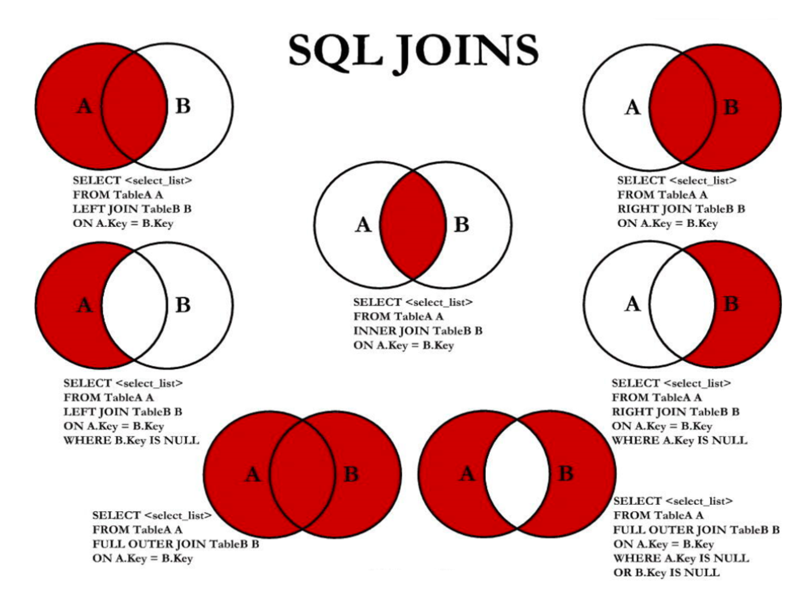

# 第06章 多表查询

> 25 为什么需要多表的查询

```text
SELECT ..., ..., ...
FROM ...
WHERE ... AND / OR / NOT ...
ORDER ... (ASC/DESC), ..., ...
LIMIT ..., ...
```

## 1. 熟悉常见的几个表

```mysql
DESC employees;
DESC departments;
DESC locations;

# 练习: 查询员工名为'Abel'的人在哪个城市工作?
SELECT *
FROM employees
WHERE last_name = 'Abel'; # department_id = 80

SELECT *
FROM departments
WHERE department_id = 80; # location_id = 2500

SELECT *
FROM locations
WHERE location_id = 2500;
```

> 26 笛卡尔积的错误与正确的多表查询

## 2. 出现笛卡尔积的错误


```mysql

# 错误的实现方式: 每个员工都与每个部门匹配了一遍。
# 错误的原因: 缺少了多表的连接条件。
SELECT employee_id, department_name
FROM employees,
     departments;
# 查询出2889条记录

# 错误的实现方式: 与上面相同
SELECT employee_id, department_name
FROM employees
         CROSS JOIN departments;

SELECT *
FROM employees; # 107条记录

SELECT 2889 / 107
FROM DUAL; # -> 27

SELECT *
FROM departments; # 27条记录
```

## 3. 多表查询的正确方式: 需要有连接条件

```mysql
SELECT employee_id, department_name
FROM employees,
     departments
# 两个表的连接条件
WHERE employees.department_id = departments.department_id;
```

## 4. 如果查询语句中出现了多个表中都存在的字段，则必须指明次字段所在的表。

```mysql
SELECT employee_id, department_name, employees.department_id
FROM employees,
     departments
WHERE employees.department_id = departments.department_id;

# 建议: 从SQL优化的角度，建议多表查询时，每个字段前都指明其所在的表。
```

## 5. 可以给表起别名，在SELECT和WHERE中使用表的别名。

```mysql
SELECT emp.employee_id, dept.department_name, emp.department_id
FROM employees emp,
     departments dept
WHERE emp.department_id = dept.department_id;

# 如果给表起了别名，一旦在SELECT或WHERE中使用表名的话，则必须使用表的别名，而不能再使用表的原名。
# 如下的操作是错误的:
SELECT emp.employee_id, dept.department_name, employees.department_id
FROM employees emp,
     departments dept
WHERE emp.department_id = departments.department_id
```

## 6. 结论: 如果有n个表实现多表的查询，则需要至少n-1个连接条件。

```mysql
# 练习: 查询员工的employee_id, last_name, department_name, city
SELECT e.employee_id, e.last_name, d.department_name, l.city, e.department_id, l.location_id
FROM employees e,
     departments d,
     locations l
WHERE e.department_id = d.department_id
  AND d.location_id = l.location_id;
```

> 27 等值连接vs非等值连接、自连接vs非自连接

```mysql
/*
演绎式: 提出问题1 --> 解决问题1 --> 提出问题2 --> 解决问题2 ...

归纳式: 总 --> 分
*/
```

## 7. 多表查询的分类

```mysql
/*
角度1: 等值连接 vs 非等值连接

角度2: 自连接 vs 非自连接

角度3: 内连接 vs 外连接
*/
```

### 7.1 等值连接 vs 非等值连接

```mysql
# 非等值连接的例子:
SELECT *
FROM job_grades;

SELECT e.last_name, e.salary, j.grade_level
FROM employees e,
     job_grades j
# WHERE e.salary BETWEEN j.lowest_sal AND j.highest_sal;
WHERE e.salary >= j.lowest_sal
  AND e.salary <= j.highest_sal;
```

### 7.2 自连接 vs 非自连接

```mysql
SELECT *
FROM employees;

# 自连接的例子:
# 练习: 查询员工id，员工姓名及其管理者的id和姓名。
SELECT emp.employee_id, emp.last_name, mgr.employee_id, mgr.last_name
FROM employees emp,
     employees mgr
WHERE emp.manager_id = mgr.employee_id;
```

> 28 SQL92于SQL99语法如何实现内连接和外连接

### 7.3 内连接 vs 外连接

```mysql
# 内连接: 合并具有同一列的两个以上的表的行，结果集中不包含一个表与另一个表不匹配的行
SELECT employee_id, department_name
FROM employees e,
     departments d
WHERE e.department_id = d.department_id;

# 外连接: 合并具有同一列的两个以上的表的行，结果集中除了包含一个表与另一个表匹配的行之外，
#       还查询到了左表 或 右表中不匹配的行。

# 外连接的分类: 左外连接、右外连接、满外连接

# 左外连接: 两个表在连接过程中除了返回满足连接条件的行以外还返回左表中不满足条件的行，这种连接称为左外连接。
# 右外连接: 两个表在连接过程中除了返回满足连接条件的行以外还返回右表中不满足条件的行，这种连接称为右外连接。

# 练习: 查询所有的员工的last_name，department_name信息。
SELECT employee_id, department_name
FROM employees e,
     departments d
WHERE e.department_id = d.department_id;
# 需要使用左外连接

# SQL92语法实现内连接: 见上，略。
# SQL92语法实现外连接: 使用 '+'。 ------> MySQL不支持SQL92语法中外连接的写法!
# 不支持:
/*
SELECT e.employee_id, d.department_name
FROM employees e,
     departments d
WHERE e.department_id = d.department_id(+);
 */

# SQL99语法中使用JOIN...ON的方式实现多表的查询。这种方式也能解决外连接的问题。 MySQL是支持这种方式的。
# SQL99语法如何实现多表的查询?

# SQL99语法实现内连接:
SELECT e.last_name, d.department_name
FROM employees e
         INNER JOIN departments d
                    ON e.department_id = d.department_id;

SELECT e.last_name, d.department_name, l.city
FROM employees e
         JOIN departments d
              ON e.department_id = d.department_id
         JOIN locations l
              ON d.location_id = l.location_id;

# SQL99语法实现外连接:

# 练习: 查询所有的员工的last_name，department_name信息。
# 左外连接
SELECT e.last_name, d.department_name
FROM employees e
         LEFT JOIN departments d
                   ON e.department_id = d.department_id;

# 右外连接
SELECT e.last_name, d.department_name
FROM employees e
         RIGHT OUTER JOIN departments d
                          ON e.department_id = d.department_id;

# 满外连接: MySQL不支持FULL OUTER JOIN。
/*
SELECT e.last_name, d.department_name
FROM employees e
         FULL OUTER JOIN departments d
              ON e.department_id = d.department_id; 
 */
```

> 29 使用SQL99实现7种JOIN操作

## 8. UNION和UNION ALL的使用

```mysql
# UNION: 会执行去重操作。
# UNION ALL: 不会执行去重操作。
# 结论: 如果明确知道合并数据后的结果数据不存在重复数据，或者不需要去除重复的数据，
#       则尽量使用UNION ALL语句，以提高数据查询的效率。
```

## 9. 7种JOIN的实现:



```mysql
# 中图: 内连接
SELECT e.employee_id, d.department_name
FROM employees e
         JOIN departments d
              ON e.department_id = d.department_id;

# 左上图: 左外连接
SELECT e.employee_id, d.department_name
FROM employees e
         LEFT JOIN departments d
                   ON e.department_id = d.department_id;

# 右上图: 右外连接
SELECT e.employee_id, d.department_name
FROM employees e
         RIGHT JOIN departments d
                    ON e.department_id = d.department_id;

# 左中图:
SELECT e.employee_id, d.department_name
FROM employees e
         LEFT JOIN departments d
                   ON e.department_id = d.department_id
WHERE d.department_id IS NULL;

# 右中图:
SELECT e.employee_id, d.department_name
FROM employees e
         RIGHT JOIN departments d
                    ON e.department_id = d.department_id
WHERE e.department_id IS NULL;

# 左下图: 满外连接
# 方式1: 左上图 UNION ALL 右中图
SELECT e.employee_id, d.department_name
FROM employees e
         LEFT JOIN departments d
                   ON e.department_id = d.department_id
UNION ALL
SELECT e.employee_id, d.department_name
FROM employees e
         RIGHT JOIN departments d
                    ON e.department_id = d.department_id
WHERE e.department_id IS NULL;

# 方式2: 右上图 UNION ALL 左中图
SELECT e.employee_id, d.department_name
FROM employees e
         RIGHT JOIN departments d
                    ON e.department_id = d.department_id
UNION ALL
SELECT e.employee_id, d.department_name
FROM employees e
         LEFT JOIN departments d
                   ON e.department_id = d.department_id
WHERE d.department_id IS NULL;

# 右下图: 左中图 UNION ALL 右中图
SELECT e.employee_id, d.department_name
FROM employees e
         LEFT JOIN departments d
                   ON e.department_id = d.department_id
WHERE d.department_id IS NULL
UNION ALL
SELECT e.employee_id, d.department_name
FROM employees e
         RIGHT JOIN departments d
                    ON e.department_id = d.department_id
WHERE e.department_id IS NULL;
```

> 30 NATURAL JOIN与USING的使用

## 10. SQL99语法的新特性1: 自然连接

```mysql
SELECT e.employee_id, e.last_name, d.department_name
FROM employees e
         JOIN departments d
              ON e.department_id = d.department_id
                  AND e.manager_id = d.manager_id;

# NATURAL JOIN: 它会帮你自动查询两张连接表中*所有相同的字段*，然后进行*等值连接*。
SELECT e.employee_id, e.last_name, d.department_name
FROM employees e
         NATURAL JOIN departments d;
```

## 11. SQL99语法的新特性2: USING

```mysql
SELECT e.employee_id, e.last_name, d.department_name
FROM employees e
         JOIN departments d
              ON e.department_id = d.department_id;

# 在USING的括号中指定同名的连接字段
SELECT e.employee_id, e.last_name, d.department_name
FROM employees e
         JOIN departments d
              USING (department_id);

# 拓展: 可以先JOIN多个表，再在后面指定表的连接条件。
SELECT e.last_name, j.job_title, d.department_name
FROM employees e
         INNER JOIN departments d
         INNER JOIN jobs j
                    ON e.department_id = d.department_id
                        AND e.job_id = j.job_id;
```

> 31 第6章 多表查询 课后练习

## 课后练习

### 多表查询-1

```mysql
# 1.显示所有员工的姓名，部门号和部门名称。
SELECT e.last_name, e.department_id, d.department_name
FROM employees e
         LEFT JOIN departments d
                   ON e.department_id = d.department_id;

# 2.查询90号部门员工的job_id和90号部门的location_id
SELECT e.job_id, d.location_id
FROM employees e
         JOIN departments d
              ON e.department_id = d.department_id
WHERE d.department_id = 90;

# 3.选择所有有奖金的员工的 last_name , department_name , location_id , city
SELECT e.last_name, e.commission_pct, d.department_id, d.location_id, l.city
FROM employees e
         LEFT JOIN departments d
                   ON e.department_id = d.department_id
         LEFT JOIN locations l
                   ON d.location_id = l.location_id
WHERE e.commission_pct IS NOT NULL; # 也应该是35条记录

SELECT *
FROM employees
WHERE commission_pct IS NOT NULL;
# 35条记录

# 4.选择city在Toronto工作的员工的 last_name , job_id , department_id , department_name
SELECT e.last_name, e.job_id, e.department_id, d.department_name
FROM employees e
         JOIN departments d
              ON e.department_id = d.department_id
         JOIN locations l
              ON d.location_id = l.location_id
WHERE l.city = 'Toronto';

# SQL92语法:
SELECT e.last_name, e.job_id, e.department_id, d.department_name
FROM employees e,
     departments d,
     locations l
WHERE e.department_id = d.department_id
  AND d.location_id = l.location_id
  AND l.city = 'Toronto';

# 5.查询员工所在的部门名称、部门地址、姓名、工作、工资，其中员工所在部门的部门名称为’Executive’
# 一般情况:
SELECT d.department_name, l.street_address, e.last_name, e.job_id, e.salary
FROM employees e
         JOIN departments d
              ON e.department_id = d.department_id
         JOIN locations l
              ON d.location_id = l.location_id
WHERE d.department_name = 'Executive';

# 如果考虑到在不同的地点(location)有同名的部门的情况，那么此查询应该这么写:
SELECT d.department_name, l.street_address, e.last_name, e.job_id, e.salary
FROM departments d
         LEFT JOIN employees e
                   ON d.department_id = e.department_id
         LEFT JOIN locations l
                   ON d.location_id = l.location_id
WHERE d.department_name = 'Executive';

# 6.选择指定员工的姓名，员工号，以及他的管理者的姓名和员工号，结果类似于下面的格式
# employee Emp# manager Mgr#
# Kochhar 101 King 100
SELECT emp.last_name employee, emp.employee_id "Emp#", mgr.last_name manager, mgr.employee_id "Mgr#"
FROM employees emp
         LEFT JOIN employees mgr
                   ON emp.manager_id = mgr.employee_id;

# 7.查询哪些部门没有员工
SELECT d.department_id, d.department_name
FROM departments d
         LEFT JOIN employees e
                   ON d.department_id = e.department_id
WHERE e.department_id IS NULL;

# 本题也可以使用子查询:
SELECT d.department_id, d.department_name
FROM departments d
WHERE NOT EXISTS(SELECT * FROM employees e WHERE e.department_id = d.department_id);

# 8. 查询哪个城市没有部门
SELECT l.location_id, l.city
FROM locations l
         LEFT JOIN departments d
                   ON l.location_id = d.location_id
WHERE d.location_id IS NULL;

# 9. 查询部门名为 Sales 或 IT 的员工信息
SELECT e.employee_id, e.last_name, e.department_id, d.department_name
FROM employees e
         JOIN departments d
              ON e.department_id = d.department_id
WHERE d.department_name IN ('Sales', 'IT');
```

### 多表查询-2

```mysql
# 准备工作: 建表和数据。
CREATE TABLE `t_dept`
(
    `id`       INT(11) NOT NULL AUTO_INCREMENT,
    `deptName` VARCHAR(30) DEFAULT NULL,
    `address`  VARCHAR(40) DEFAULT NULL,
    PRIMARY KEY (`id`)
) ENGINE = INNODB
  AUTO_INCREMENT = 1
  DEFAULT CHARSET = utf8;

CREATE TABLE `t_emp`
(
    `id`     INT(11) NOT NULL AUTO_INCREMENT,
    `name`   VARCHAR(20) DEFAULT NULL,
    `age`    INT(3)      DEFAULT NULL,
    `deptId` INT(11)     DEFAULT NULL,
    empno    INT     NOT NULL,
    PRIMARY KEY (`id`),
    KEY `idx_dept_id` (`deptId`)
) ENGINE = INNODB
  AUTO_INCREMENT = 1
  DEFAULT CHARSET = utf8;

INSERT INTO t_dept(deptName, address)
VALUES ('华山', '华山');
INSERT INTO t_dept(deptName, address)
VALUES ('丐帮', '洛阳');
INSERT INTO t_dept(deptName, address)
VALUES ('峨眉', '峨眉山');
INSERT INTO t_dept(deptName, address)
VALUES ('武当', '武当山');
INSERT INTO t_dept(deptName, address)
VALUES ('明教', '光明顶');
INSERT INTO t_dept(deptName, address)
VALUES ('少林', '少林寺');
INSERT INTO t_emp(NAME, age, deptId, empno)
VALUES ('风清扬', 90, 1, 100001);
INSERT INTO t_emp(NAME, age, deptId, empno)
VALUES ('岳不群', 50, 1, 100002);
INSERT INTO t_emp(NAME, age, deptId, empno)
VALUES ('令狐冲', 24, 1, 100003);
INSERT INTO t_emp(NAME, age, deptId, empno)
VALUES ('洪七公', 70, 2, 100004);
INSERT INTO t_emp(NAME, age, deptId, empno)
VALUES ('乔峰', 35, 2, 100005);
INSERT INTO t_emp(NAME, age, deptId, empno)
VALUES ('灭绝师太', 70, 3, 100006);
INSERT INTO t_emp(NAME, age, deptId, empno)
VALUES ('周芷若', 20, 3, 100007);
INSERT INTO t_emp(NAME, age, deptId, empno)
VALUES ('张三丰', 100, 4, 100008);
INSERT INTO t_emp(NAME, age, deptId, empno)
VALUES ('张无忌', 25, 5, 100009);
INSERT INTO t_emp(NAME, age, deptId, empno)
VALUES ('韦小宝', 18, NULL, 100010);

SELECT *
FROM t_dept;

SELECT *
FROM t_emp;

# 1.所有有门派的人员信息 (A、B两表共有)
SELECT e.empno, e.name, d.id, d.deptName
FROM t_emp e
         JOIN t_dept d
              ON e.deptId = d.id;

# 2.列出所有用户，并显示其机构信息 (A的全集)
SELECT e.empno, e.name, d.id, d.deptName
FROM t_emp e
         LEFT JOIN t_dept d
                   ON e.deptId = d.id;

# 3.列出所有门派 (B的全集)
SELECT e.empno, e.name, d.id, d.deptName
FROM t_emp e
         RIGHT JOIN t_dept d
                    ON e.deptId = d.id;

# 4.所有不入门派的人员 (A的独有)
SELECT e.empno, e.name, d.id, d.deptName
FROM t_emp e
         LEFT JOIN t_dept d
                   ON e.deptId = d.id
WHERE d.id IS NULL;

# 5.所有没人入的门派 (B的独有)
SELECT e.empno, e.name, d.id, d.deptName
FROM t_emp e
         RIGHT JOIN t_dept d
                    ON e.deptId = d.id
WHERE e.deptId IS NULL;

# 6.列出所有人员和机构的对照关系 (AB全有)
# MySQL Full Join的实现 因为MySQL不支持FULL JOIN,下面是替代方法
SELECT e.empno, e.name, d.id, d.deptName
FROM t_emp e
         LEFT JOIN t_dept d
                   ON e.deptId = d.id
UNION ALL
SELECT e.empno, e.name, d.id, d.deptName
FROM t_emp e
         RIGHT JOIN t_dept d
                    ON e.deptId = d.id
WHERE e.deptId IS NULL;

# 7.列出所有没入派的人员和没人入的门派 (A的独有+B的独有)
SELECT e.empno, e.name, d.id, d.deptName
FROM t_emp e
         LEFT JOIN t_dept d
                   ON e.deptId = d.id
WHERE d.id IS NULL
UNION ALL
SELECT e.empno, e.name, d.id, d.deptName
FROM t_emp e
         RIGHT JOIN t_dept d
                    ON e.deptId = d.id
WHERE e.deptId IS NULL;
```

