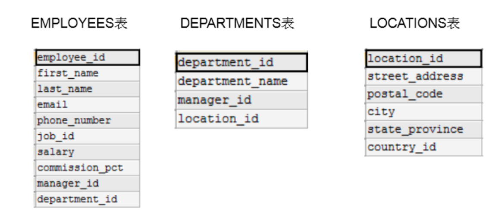

# 第06章 多表查询

> 25 为什么需要多表的查询

```text
SELECT ..., ..., ...
FROM ...
WHERE ... AND / OR / NOT ...
ORDER ... (ASC/DESC), ..., ...
LIMIT ..., ...
```

## 1. 熟悉常见的几个表

```mysql
DESC employees;
DESC departments;
DESC locations;

# 练习: 查询员工名为'Abel'的人在哪个城市工作?
SELECT *
FROM employees
WHERE last_name = 'Abel'; # department_id = 80

SELECT *
FROM departments
WHERE department_id = 80; # location_id = 2500

SELECT *
FROM locations
WHERE location_id = 2500;
```

> 26 笛卡尔积的错误与正确的多表查询

## 2. 出现笛卡尔积的错误



```mysql

# 错误的实现方式: 每个员工都与每个部门匹配了一遍。
# 错误的原因: 缺少了多表的连接条件。
SELECT employee_id, department_name
FROM employees,
     departments;
# 查询出2889条记录

# 错误的实现方式: 与上面相同
SELECT employee_id, department_name
FROM employees
         CROSS JOIN departments;

SELECT *
FROM employees; # 107条记录

SELECT 2889 / 107
FROM DUAL; # -> 27

SELECT *
FROM departments; # 27条记录
```

## 3. 多表查询的正确方式: 需要有连接条件

```mysql
SELECT employee_id, department_name
FROM employees,
     departments
# 两个表的连接条件
WHERE employees.department_id = departments.department_id;
```

## 4. 如果查询语句中出现了多个表中都存在的字段，则必须指明次字段所在的表。

```mysql
SELECT employee_id, department_name, employees.department_id
FROM employees,
     departments
WHERE employees.department_id = departments.department_id;

# 建议: 从SQL优化的角度，建议多表查询时，每个字段前都指明其所在的表。
```

## 5. 可以给表起别名，在SELECT和WHERE中使用表的别名。

```mysql
SELECT emp.employee_id, dept.department_name, emp.department_id
FROM employees emp,
     departments dept
WHERE emp.department_id = dept.department_id;

# 如果给表起了别名，一旦在SELECT或WHERE中使用表名的话，则必须使用表的别名，而不能再使用表的原名。
# 如下的操作是错误的:
SELECT emp.employee_id, dept.department_name, employees.department_id
FROM employees emp,
     departments dept
WHERE emp.department_id = departments.department_id
```

## 6. 结论: 如果有n个表实现多表的查询，则需要至少n-1个连接条件。

```mysql
# 练习: 查询员工的employee_id, last_name, department_name, city
SELECT e.employee_id, e.last_name, d.department_name, l.city, e.department_id, l.location_id
FROM employees e,
     departments d,
     locations l
WHERE e.department_id = d.department_id
  AND d.location_id = l.location_id;
```

> 27 等值连接vs非等值连接、自连接vs非自连接

```mysql
/*
演绎式: 提出问题1 --> 解决问题1 --> 提出问题2 --> 解决问题2 ...

归纳式: 总 --> 分
*/
```

## 7. 多表查询的分类

```mysql
/*
角度1: 等值连接 vs 非等值连接

角度2: 自连接 vs 非自连接

角度3: 内连接 vs 外连接
*/
```

### 7.1 等值连接 vs 非等值连接

```mysql
# 非等值连接的例子:
SELECT *
FROM job_grades;

SELECT e.last_name, e.salary, j.grade_level
FROM employees e,
     job_grades j
# WHERE e.salary BETWEEN j.lowest_sal AND j.highest_sal;
WHERE e.salary >= j.lowest_sal
  AND e.salary <= j.highest_sal;
```

### 7.2 自连接 vs 非自连接

```mysql
SELECT *
FROM employees;

# 自连接的例子:
# 练习: 查询员工id，员工姓名及其管理者的id和姓名。
SELECT emp.employee_id, emp.last_name, mgr.employee_id, mgr.last_name
FROM employees emp,
     employees mgr
WHERE emp.manager_id = mgr.employee_id;
```

