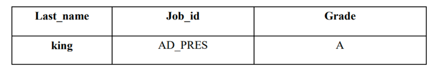

# 第07章 单行函数

> 32 函数的分类

> 33 数值类型的函数讲解

## 1. 数值函数

### 1.1 基本操作

```mysql
# 基本的操作
SELECT ABS(-123),
       ABS(32),
       SIGN(-23),
       SIGN(43),
       PI(),
       CEIL(32.32),
       CEILING(-43.23),
       FLOOR(32.32),
       FLOOR(-43.23),
       MOD(12, 5),
       12 % 5
FROM DUAL;

# 取随技数
SELECT RAND(), RAND(), RAND(10), RAND(10), RAND(-1), RAND(-1)
FROM DUAL;

# 四舍五入，截断操作
SELECT ROUND(123.456),
       ROUND(123.456, 0),
       ROUND(123.456, 1),
       ROUND(123.456, 2),
       ROUND(123.456, -1),
       ROUND(123.456, -2),
       ROUND(153.456, -2)
FROM DUAL;

SELECT TRUNCATE(123.456, 0), TRUNCATE(123.496, 1), TRUNCATE(129.45, -1)
FROM DUAL;

# 单行函数可以嵌套
SELECT TRUNCATE(ROUND(123.456, 2), 0)
FROM DUAL;
```

### 1.2 角度与弧度的互换

```mysql
SELECT RADIANS(30), RADIANS(45), RADIANS(60), RADIANS(90), DEGREES(2 * PI()), DEGREES(RADIANS(60))
FROM DUAL;
```

### 1.3 三角函数

```mysql
SELECT SIN(RADIANS(30)), DEGREES(ASIN(1)), TAN(RADIANS(45)), DEGREES(ATAN(1))
FROM DUAL;
```

### 1.4 指数和对数

```mysql
SELECT POW(2, 5), POWER(2, 4), EXP(2)
FROM DUAL;

SELECT LN(EXP(2)), LOG(EXP(2)), LOG10(10), LOG2(4)
FROM DUAL;
```

### 1.5 进制间的转换

```mysql
SELECT BIN(10), HEX(10), OCT(10), CONV(10, 10, 8)
FROM DUAL;
```

> 34 字符串类型的函数讲解

## 2. 字符串的函数

```mysql
SELECT ASCII('Abc'), CHAR_LENGTH('hello'), CHAR_LENGTH('我们'), LENGTH('hello'), LENGTH('我们')
FROM DUAL;

# xxx worked for yyy.
SELECT CONCAT(emp.last_name, ' worked for ', mgr.last_name, '.') "Work Info"
FROM employees emp
         JOIN employees mgr
              ON emp.manager_id = mgr.employee_id;

# CONCAT相当于CONCAT_WS一种特殊情况。如果CONCAT_WS的第一个参数为''，那么这两个函数效果相同。
SELECT CONCAT_WS('-', 'hello', 'world', 'hello', 'seoul')
FROM DUAL;

# 字符串的索引是从1开始的。
SELECT INSERT('helloworld', 2, 3, 'aaaaa'), REPLACE('hello', 'll', 'mmm')
FROM DUAL;

SELECT UPPER('Hello'), LOWER('Hello')
FROM DUAL;

SELECT LEFT('hello', 2), RIGHT('hello', 3), RIGHT('hello', 13)
FROM DUAL;

# LPAD: 实现右对齐的效果
# RPAD: 实现左对齐的效果
SELECT employee_id, last_name, LPAD(salary, 10, '*')
FROM employees;

SELECT CONCAT('---', TRIM('     he  ll   o    '), '---'),
       CONCAT('---', LTRIM('     he  ll   o    '), '---'),
       CONCAT('---', RTRIM('     he  ll   o    '), '---'),
       TRIM('e' FROM 'eehelloeeee')
FROM DUAL;

SELECT REPEAT('hello', 4), CONCAT('@', SPACE(5), '@'), STRCMP('abc', 'abd')
FROM DUAL;

SELECT SUBSTR('hello', 2, 2), LOCATE('ll', 'hello')
FROM DUAL;

SELECT ELT(3, 'a', 'b', 'c', 'd'),
       FIELD('mm', 'gg', 'jj', 'mm', 'dd', 'mm'),
       FIND_IN_SET('mm', 'gg,mm,jj,dd,mm,gg')
FROM DUAL;

SELECT employee_id, first_name, last_name, NULLIF(LENGTH(first_name), LENGTH(last_name)) "compare"
FROM employees;
```

> 35 日期时间类型的函数讲解

## 3. 日期时间类型的函数讲解

### 3.1 获取日期、时间

```mysql
SELECT CURDATE(),
       CURRENT_DATE(),
       CURTIME(),
       NOW(),
       SYSDATE(),
       UTC_DATE(),
       UTC_TIME()
FROM dual;

SELECT CURDATE(), CURDATE() + 0, CURTIME(), CURTIME() + 0, NOW() + 0
FROM DUAL;
```

### 3.2 日期与时间戳的转换

```mysql
SELECT UNIX_TIMESTAMP(),
       UNIX_TIMESTAMP('2025-08-26 12:12:32'),
       FROM_UNIXTIME(1751925042),
       FROM_UNIXTIME(1756210352)
FROM DUAL;
```

### 3.3 获取月份、星期、星期数、天数等函数

```mysql
SELECT YEAR(CURDATE()),
       MONTH(CURDATE()),
       DAY(CURDATE()),
       HOUR(CURTIME()),
       MINUTE(NOW()),
       SECOND(SYSDATE())
FROM DUAL;

SELECT MONTHNAME('2025-07-08'),
       DAYNAME('2025-07-08'),
       WEEKDAY('2025-07-08'),
       QUARTER(CURDATE()),
       WEEK(CURDATE()),
       DAYOFYEAR(NOW()),
       DAYOFMONTH(NOW()),
       DAYOFWEEK(NOW())
FROM DUAL;
```

### 3.4 日期的操作函数

```mysql
SELECT EXTRACT(SECOND FROM NOW()),
       EXTRACT(DAY FROM NOW()),
       EXTRACT(HOUR_MINUTE FROM NOW()),
       EXTRACT(QUARTER FROM NOW()),
       EXTRACT(MONTH FROM '2025-07-06')
FROM DUAL;
```

### 3.5 时间和秒钟转换的函数

```mysql
SELECT TIME_TO_SEC(CURTIME()), SEC_TO_TIME(79646)
FROM DUAL;
```

### 3.6 计算日期和时间的函数

```mysql
SELECT NOW(),
       DATE_ADD(NOW(), INTERVAL 1 YEAR),
       DATE_ADD(NOW(), INTERVAL -1 YEAR),
       DATE_SUB(NOW(), INTERVAL 1 YEAR)
FROM DUAL;

SELECT DATE_ADD(NOW(), INTERVAL 1 DAY)                               AS col1,
       DATE_ADD('2021-10-21 23:32:12', INTERVAL 1 SECOND)            AS col2,
       ADDDATE('2021-10-21 23:32:12', INTERVAL 1 SECOND)             AS col3,
       DATE_ADD('2021-10-21 23:32:12', INTERVAL '1_1' MINUTE_SECOND) AS col4, # 需要单引号
       DATE_ADD(NOW(), INTERVAL -1 YEAR)                             AS col5, # 可以是负数
       DATE_ADD(NOW(), INTERVAL '1_1' YEAR_MONTH)                    AS col6  # 需要单引号
FROM DUAL;

SELECT ADDTIME(NOW(), 20),
       SUBTIME(NOW(), 30),
       SUBTIME(NOW(), '1:1:3'),
       DATEDIFF(NOW(), '2025-07-01'),
       TIMEDIFF(NOW(), '2025-07-07 18:30:32'),
       FROM_DAYS(366),
       TO_DAYS('0000-12-25'),
       LAST_DAY(NOW()),
       MAKEDATE(YEAR(NOW()), 12),
       MAKETIME(10, 21, 23),
       PERIOD_ADD(20200101010101, 10)
FROM DUAL;
```

### 3.7 日起的格式化与解析

```mysql
# 格式化: 日期 --> 字符串
# 解析: 字符串 --> 日期
# 此时我们谈的是日期的显式格式化和解析。
# 之前，我们接触过隐式的格式化和解析。
SELECT *
FROM employees
WHERE hire_date = '1993-01-13';

# 格式化:
SELECT DATE_FORMAT(CURDATE(), '%Y-%M-%D'),
       DATE_FORMAT(NOW(), '%Y-%m-%d'),
       TIME_FORMAT(CURTIME(), '%H:%i:%s'),
       DATE_FORMAT(NOW(), '%Y-%M-%D %h:%i:%S %W %w %T %r')
FROM DUAL;

# 解析: 格式化的逆过程
SELECT STR_TO_DATE('2025-July-9th 09:44:41 Wednesday 3 09:44:41 09:44:41 AM', '%Y-%M-%D %h:%i:%S %W %w %T %r')
FROM DUAL;

SELECT GET_FORMAT(DATE, 'USA')
FROM DUAL;

SELECT DATE_FORMAT(CURDATE(), GET_FORMAT(DATE, 'USA'))
FROM DUAL;
```

> 36 流程控制函数讲解

## 4. 流程控制函数

### 4.1 IF(VALUE, VALUE1, VALUE2)

```mysql
SELECT last_name, salary, IF(salary >= 6000, '高工资', '低工资') "details"
FROM employees;

SELECT last_name,
       commission_pct,
       IF(commission_pct IS NOT NULL, commission_pct, 0)                     "details",
       salary * 12 * (1 + IF(commission_pct IS NOT NULL, commission_pct, 0)) "annual_sal"
FROM employees;
```

### 4.2 IFNULL(VALUE1, VALUE2): 可以看作是IF(VALUE, VALUE1, VALUE2)的特殊情况

```mysql

SELECT last_name, commission_pct, IFNULL(commission_pct, 0) "details"
FROM employees;
```

### 4.3 CASE WHEN ... THEN ... WHEN ... THEN ... ELSE ... END

```mysql
# 类似于Java的if ... else if ... else ... else结构。
SELECT last_name,
       salary,
       CASE
           WHEN salary >= 15000 THEN '白骨精'
           WHEN salary >= 10000 THEN '潜力股'
           WHEN salary >= 8000 THEN '小屌丝'
           END "details",
       department_id
FROM employees;
```

### 4.4 CASE ... WHEN ... THEN ... WHEN ... THEN ... ELSE ... END

```mysql
# 类似于Java的switch ... case ...结果。

# 练习1: 演示有ELSE的情况
# 查询部门号为10，20，30的员工信息，
# 若部门号为10，则打印其工资的1.1倍，
# 若部门号为20，则打印其工资的1.2倍，
# 若部门号为30，则打印其工资的1.3倍，
# 其它部门，打印其工资的1.4倍。
SELECT employee_id,
       last_name,
       department_id,
       salary,
       CASE department_id
           WHEN 10 THEN salary * 1.1
           WHEN 20 THEN salary * 1.2
           WHEN 30 THEN salary * 1.3
           ELSE salary * 1.4 END "details"
FROM employees;

# 练习2: 演示没有ELSE的情况
# 查询部门号为10，20，30的员工信息，
# 若部门号为10，则打印其工资的1.1倍，
# 若部门号为20，则打印其工资的1.2倍，
# 若部门号为30，则打印其工资的1.3倍。
SELECT employee_id,
       last_name,
       department_id,
       salary,
       CASE department_id
           WHEN 10 THEN salary * 1.1
           WHEN 20 THEN salary * 1.2
           WHEN 30 THEN salary * 1.3
           END "details"
FROM employees
WHERE department_id IN (10, 20, 30);
```

> 37 加密解密 MySQL信息函数等讲解

## 5. 加密与解密

```mysql
# 下面的PASSWORD函数在MySQL8.0版本中被弃用了。
/*
SELECT PASSWORD('mysql')
FROM DUAL;
 */

SELECT MD5('mysql'), SHA('mysql'), MD5(MD5('mysql'))
FROM DUAL;

# ENCODE()\DECODE()在MySQL8.0版本中也被弃用了。
/*
SELECT ENCODE('atguigu', 'mysql'), DECODE(ENCODE('atguigu', 'mysql'), 'mysql')
FROM DUAL;
 */
```

## 6. MySQL信息函数

```mysql
SELECT VERSION(),
       CONNECTION_ID(),
       DATABASE(),
       SCHEMA(),
       USER(),
       CURRENT_USER(),
       CHARSET('尚硅谷'),
       COLLATION('尚硅谷')
FROM DUAL;
```

## 7. 其它函数

```mysql
# FORMAT(value, n): 如果n的值小于或者等于0，则只保留整数部分。
SELECT FORMAT(123.125, 2), FORMAT(123.125, 0), FORMAT(123.125, -2)
FROM DUAL;

SELECT CONV(16, 10, 2), CONV(8888, 10, 16), CONV(NULL, 10, 2)
FROM DUAL;

# 以“192.168.1.100”为例，计算方式为192乘以256的3次方，加上168乘以256的2次方，加上1乘以256，再加上100。
SELECT INET_ATON('192.168.1.100'), INET_NTOA(3232235876)
FROM DUAL;

# BENCHMARK()用于测试表达式的执行效率。
SELECT BENCHMARK(10000, MD5('mysql'))
FROM DUAL;

# CONVERT()可以实现字符集的转换。
SELECT CHARSET('atguigu'), CHARSET(CONVERT('atguigu' USING 'utf8mb3'))
FROM DUAL;
```

> 38 第7章 单行函数 课后练习

## 课后练习

```mysql
# 1.显示系统时间(注: 日期+时间)
SELECT CURDATE(), CURTIME(), NOW(), SYSDATE(), CURRENT_TIMESTAMP(), LOCALTIME(), LOCALTIMESTAMP()
FROM DUAL;

# 2.查询员工号，姓名，工资，以及工资提高百分之20%后的结果(new salary)
SELECT employee_id, last_name, salary, salary * 1.2 "new salary"
FROM employees;

# 3.将员工的姓名按首字母排序，并写出姓名的长度(length)
SELECT last_name, LENGTH(last_name)
FROM employees
ORDER BY last_name;

# 拓展: 将员工的姓名按长度排序，并写出姓名的长度(length)
SELECT last_name, LENGTH(last_name) "name_length"
FROM employees
ORDER BY name_length;

# 4.查询员工id,last_name,salary，并作为一个列输出，别名为OUT_PUT
SELECT CONCAT(employee_id, ',', last_name, ',', salary) "OUT_PUT"
FROM employees;

# 5.查询公司各员工工作的年数、工作的天数，并按工作年数的降序排序
SELECT employee_id,
       hire_date,
       DATEDIFF(CURDATE(), hire_date) / 365    "worked_years",
       DATEDIFF(CURDATE(), hire_date)          "worked_days",
       TO_DAYS(CURDATE()) - TO_DAYS(hire_date) "worked_days1" # 计算天数的另一种方式
FROM employees
ORDER BY worked_years DESC;

# 6.查询员工姓名，hire_date , department_id，满足以下条件：雇用时间在1997年之后，department_id为80或90或110, commission_pct不为空
SELECT last_name, hire_date, department_id
FROM employees
WHERE department_id IN (80, 90, 110)
  AND commission_pct IS NOT NULL
# AND hire_date >= '1997-01-01'; # 存在隐式的转换
# AND DATE_FORMAT(hire_date, '%Y-%m-%d') >= '1997-01-01'; # 显式转换操作: 格式化: 日期 --> 字符串
# AND DATE_FORMAT(hire_date, '%Y') >= '1997'; # 显式转换操作
  AND hire_date >= STR_TO_DATE('1997-01-01', '%Y-%m-%d');
# 显式转换操作: 解析: 字符串 --> 日期

# 7.查询公司中入职超过10000天的员工姓名、入职时间
SELECT last_name, hire_date
FROM employees
WHERE DATEDIFF(CURDATE(), hire_date) >= 10000;

# 8.做一个查询，产生下面的结果
# <last_name> earns <salary> monthly but wants <salary*3>
SELECT CONCAT(last_name, ' earns ', TRUNCATE(salary, 0), ' monthly but wants ', TRUNCATE(salary * 3, 0),
              '.') "Dream Salary"
FROM employees;
```


```mysql
# 9.使用case-when，按照下面的条件：
/*
job grade
AD_PRES A
ST_MAN B
IT_PROG C
SA_REP D
ST_CLERK E
产生下面的结果:
 */
SELECT last_name                        "Last_name",
       job_id                           "Job_id",
       CASE job_id
           WHEN 'AD_PRES' THEN 'A'
           WHEN 'ST_MAN' THEN 'B'
           WHEN 'IT_PROG' THEN 'C'
           WHEN 'SA_REP' THEN 'D'
           WHEN 'ST_CLERK' THEN 'E' END "Grade"
FROM employees;

# 加ELSE的写法
SELECT last_name                "Last_name",
       job_id                   "Job_id",
       CASE job_id
           WHEN 'AD_PRES' THEN 'A'
           WHEN 'ST_MAN' THEN 'B'
           WHEN 'IT_PROG' THEN 'C'
           WHEN 'SA_REP' THEN 'D'
           WHEN 'ST_CLERK' THEN 'E'
           ELSE 'Undefined' END "Grade"
FROM employees;
```



