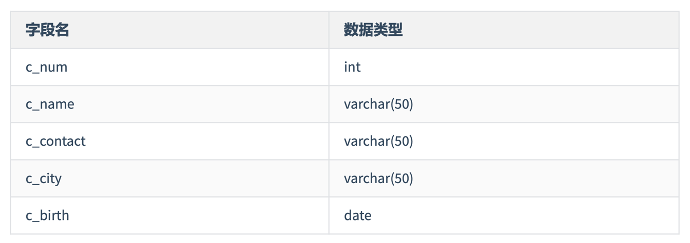
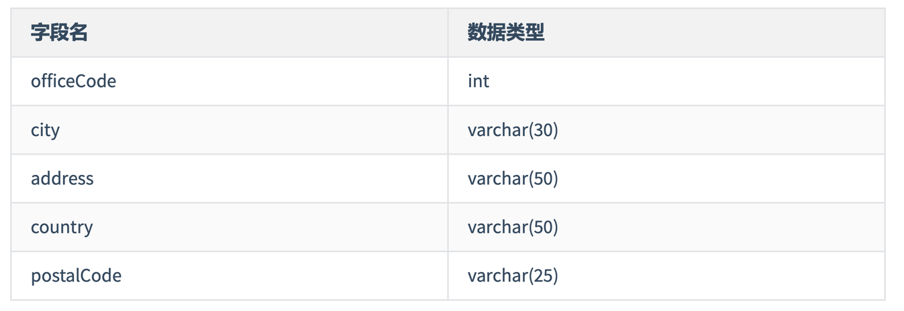
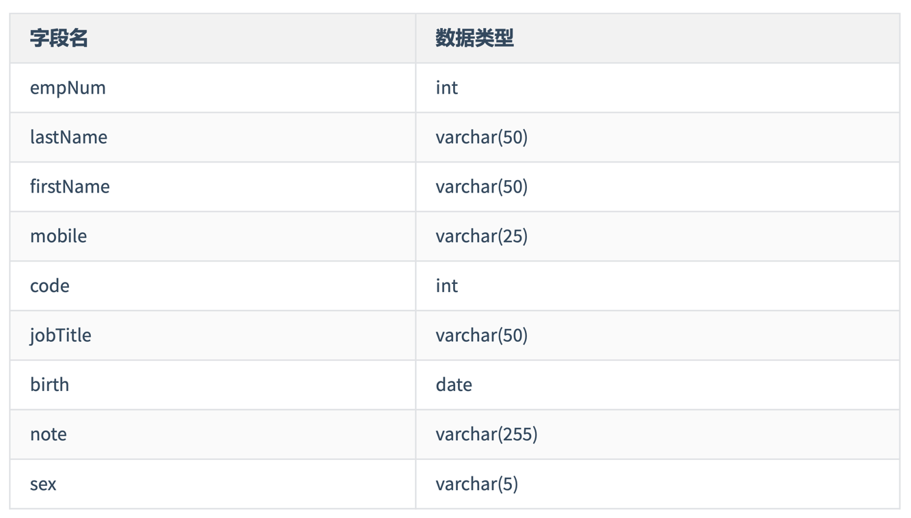

# 第10章 创建和管理表

> 49 数据库的创建、修改与删除

## 1. 创建和管理数据库

### 1.1 如何创建数据库

```mysql
# 方式1:
CREATE DATABASE mytest1;
# 创建的此数据库使用的是默认的字符集

# 查看创建数据库的结构
SHOW CREATE DATABASE mytest1;

# 方式2:
CREATE DATABASE mytest2 CHARACTER SET 'gbk';

SHOW CREATE DATABASE mytest2;

# 方式3 (推荐): 如果要创建的数据库已经存在，则创建不成功，但不会报错。
CREATE DATABASE IF NOT EXISTS mytest2 CHARACTER SET 'utf8';

# 如果要创建的数据库不存在，则创建成功。
CREATE DATABASE IF NOT EXISTS mytest3 CHARACTER SET 'utf8';

SHOW DATABASES;
```

### 1.2 管理数据库

```mysql
# 查看当前连接中的数据库有哪些
SHOW DATABASES;

# 切换数据库
USE mytest2;
USE atguigudb;

# 窗口当前数据库中保存的数据表
SHOW TABLES;

# 查看当前使用的数据库
SELECT DATABASE()
FROM DUAL;

# 查看指定数据库下保存的数据表
SHOW TABLES FROM atguigudb;
SHOW TABLES FROM mysql;
SHOW TABLES FROM mytest2;
```

### 1.3 修改数据库

```mysql
# 更改数据库的字符集
SHOW CREATE DATABASE mytest2;

ALTER DATABASE mytest2 CHARACTER SET 'utf8';
```

### 1.4 删除数据库

```mysql
# 方式1: 如果要删除的数据库存在，则成功删除。如果不存在，则报错。
DROP DATABASE mytest1;

# 方式2: 推荐。如果要删除的数据库存在，则成功删除。如果不存在，则默默结束，不会报错。
DROP DATABASE IF EXISTS mytest1;

DROP DATABASE IF EXISTS mytest2;

SHOW DATABASES;
```

> 50 常见的数据类型 创建表的两种方式

## 2. 如何创建数据表

```mysql
USE atguigudb;

SHOW CREATE DATABASE atguigudb;
# 默认使用的是utf8
# 方式1: "白手起家"的方式。

# 需要用户具备创建表的权限
CREATE TABLE IF NOT EXISTS myemp1
(
    id        INT,
    emp_name  VARCHAR(15), # 使用VARCHAR来定义字符串，必须在使用VARCHAR时指明其长度。
    hire_date DATE
);

# 查看表结构
DESC myemp1;

# 查看创建表的语句结构
SHOW CREATE TABLE myemp1;
# 如果创建表时没有指明使用的字符集，则默认使用表所在的数据看的字符集。

# 查看表数据
SELECT *
FROM myemp1;

# 方式2: 基于现有的表，同时导入数据。
CREATE TABLE myemp2
AS
SELECT employee_id, last_name, salary
FROM employees;

DESC myemp2;
DESC employees;

SELECT *
FROM myemp2;

# 说明1: 查询语句中字段的别名，可以作为新创建的表的字段的名称。
# 说明2: 此时的查询语句的结构可以很丰富，使用前面章节讲过的各种SELECT。
CREATE TABLE myemp3
AS
SELECT e.employee_id emp_id, e.last_name lname, d.department_name
FROM employees e
         JOIN departments d
              ON e.department_id = d.department_id;

SELECT *
FROM myemp3;

DESC myemp3;

# 练习1: 创建一个表employees_copy，实现对employees表的复制，包括表数据。
CREATE TABLE employees_copy
AS
SELECT *
FROM employees;

SELECT *
FROM employees_copy;

# 练习2: 创建一个表employees_blank，实现对employees表的复制，不包括表数据。
CREATE TABLE employees_blank
AS
SELECT *
FROM employees_copy
WHERE FALSE; # 山无棱，天地合，乃敢与君绝。

SELECT *
FROM employees_blank;
```

> 51 修改表 重命名表 删除表 清空表

## 3. 修改表 --> ALTER TABLE

```mysql
DESC myemp1;
```

### 3.1 添加一个字段

```mysql
ALTER TABLE myemp1
    ADD salary DOUBLE(10, 2); # 默认添加到表中的最后一个字段的位置

ALTER TABLE myemp1
    ADD phone_number VARCHAR(20) FIRST; # 添加一个字段phone_number，并将其添加成为表的第一个字段

ALTER TABLE myemp1
    ADD email VARCHAR(45) AFTER emp_name; # 添加一个字段email，并将其添加到emp_name字段到后面
```

### 3.2 修改一个字段: 数据类型、长度、默认值(略)

```mysql
ALTER TABLE myemp1
    MODIFY emp_name VARCHAR(25);

ALTER TABLE myemp1
    MODIFY emp_name VARCHAR(35) DEFAULT 'aaa';
```

### 3.3 重命名一个字段

```mysql
ALTER TABLE myemp1
    CHANGE salary monthly_salary DOUBLE(10, 2);

ALTER TABLE myemp1
    CHANGE email my_email VARCHAR(50);
```

### 3.4 删除一个字段

```mysql
ALTER TABLE myemp1
    DROP COLUMN my_email;
```

## 4. 重命名表

```mysql
# 方式1:
RENAME TABLE myemp1 TO myemp11;

SHOW TABLES;
DESC myemp11;

# 方式2:
ALTER TABLE myemp2 RENAME TO myemp12;

DESC myemp12;
```

## 5. 删除表

```mysql
# 不光将表结构删除掉，同时表中的数据也删除掉，释放表空间
DROP TABLE IF EXISTS myemp2;

DROP TABLE IF EXISTS myemp12;
```

## 6. 清空表

```mysql
# 清空表，表示清空表中的所有数据，但是表结构保留。
SELECT *
FROM employees_copy;

TRUNCATE TABLE employees_copy;

DESC employees_copy;
```

> 52 DCL中COMMIT和ROLLBACK的使用

## 7. DCL中 COMMIT 和 ROLLBACK

- COMMIT: 提交数据。一旦执行COMMIT，则数据就被永久地保存在数据库中，意味着数据不可以回滚。
- ROLLBACK: 回滚数据。一旦执行ROLLBACK，则可以实现数据的回滚。回滚到最近一次的COMMIT之后。

## 8. 对比 TRUNCATE TABLE 和 DELETE FROM

- 相同点: 都可以实现对表中所有数据的删除，同时保留表的结构。
- 不同点:
    - TRUNCATE TABLE: 一旦执行此操作，表数据全部清除。同时，数据是不可以回滚的。
    - DELETE FROM: 一旦执行此操作，表数据可以全部清除(不带WHERE)。同时，数据是可以实现回滚的。

## 9. DDL 和 DML的说明

1. DDL的操作一旦执行，就不可回滚。指令SET AUTOCOMMIT = FALSE对DDL操作实效。  
   (因为在执行完DDL操作之后，一定会执行一次COMMIT。而此COMMIT操作不受SET AUTOCOMMIT = FALSE影响的。)
2. DML的操作默认情况下，一旦执行，也是不可回滚的。但是，如果在执行DML之前，执行了SET AUTOCOMMIT = FALSE，  
   则执行的DML操作就可以实现回滚。

```mysql
# 演示: DELETE FROM
# 1)
COMMIT;
# 2)
SELECT *
FROM myemp3;
# 3)
SET AUTOCOMMIT = FALSE;
# 4)
DELETE
FROM myemp3;
# 5)
SELECT *
FROM myemp3;
# 6)
ROLLBACK;
# 7)
SELECT *
FROM myemp3;

# 演示: TRUNCATE TABLE
# 1)
COMMIT;
# 2)
SELECT *
FROM myemp3;
# 3)
SET AUTOCOMMIT = FALSE;
# 4)
TRUNCATE TABLE myemp3;
# 5)
SELECT *
FROM myemp3;
# 6)
ROLLBACK;
# 7)
SELECT *
FROM myemp3;
```

> 53 阿里MySQL命名规范及MySQL8 DDL的原子化

## 10. 测试MySQL8.0的新特性: DDL的原子化

```mysql
CREATE DATABASE IF NOT EXISTS mytest;

SHOW DATABASES;

USE mytest;

CREATE TABLE book1
(
    book_id   INT,
    book_name VARCHAR(255)
);

SHOW TABLES;

DROP TABLE book1, book2;

SHOW TABLES;

DROP DATABASE IF EXISTS mytest;
```

> 54 第10章 创建和管理表 课后练习

```mysql
# 练习1:

# 1. 创建数据库test01_office,指明字符集为utf8。并在此数据库下执行下述操作
CREATE DATABASE IF NOT EXISTS test01_office CHARACTER SET 'utf8';

SHOW CREATE DATABASE test01_office;

SHOW DATABASES;

USE test01_office;

# 2. 创建表dept01
/*
字段 类型
id INT(7)
NAME VARCHAR(25)
*/
CREATE TABLE IF NOT EXISTS dept01
(
    id     INT(7),
    `name` VARCHAR(25)
);

SHOW TABLES;

# 3. 将表departments中的数据插入新表dept02中
CREATE TABLE IF NOT EXISTS dept02
AS
SELECT *
FROM atguigudb.departments;

SHOW TABLES;

SELECT *
FROM dept02;

# 4. 创建表emp01
/*
字段 类型
id INT(7)
first_name VARCHAR (25)
last_name VARCHAR(25)
dept_id INT(7)
*/
CREATE TABLE IF NOT EXISTS emp01
(
    id         INT(7),
    first_name VARCHAR(25),
    last_name  VARCHAR(25),
    dept_id    INT(7)
);

SHOW TABLES;

DESC emp01;

# 5. 将列last_name的长度增加到50
ALTER TABLE emp01
    MODIFY last_name VARCHAR(50);

DESC emp01;

# 6. 根据表employees创建emp02
CREATE TABLE IF NOT EXISTS emp02
AS
SELECT *
FROM atguigudb.employees
WHERE FALSE;

SHOW TABLES;

# 7. 删除表emp01
DROP TABLE IF EXISTS emp01;

SHOW TABLES;

# 8. 将表emp02重命名为emp01
# 方式1:
# ALTER TABLE emp02 RENAME TO emp01;

# 方式2:
RENAME TABLE emp02 TO emp01;

SHOW TABLES FROM test01_office;

# 9.在表dept02和emp01中添加新列test_column，并检查所作的操作
DESC dept02;
DESC emp01;

ALTER TABLE dept02
    ADD COLUMN test_column VARCHAR(20) FIRST;

ALTER TABLE emp01
    ADD test_column VARCHAR(20) AFTER email;

# 10.直接删除表emp01中的列 department_id
DESC emp01;

ALTER TABLE emp01
    DROP COLUMN department_id;

# 练习2:
# 1. 创建数据库 test02_market
CREATE DATABASE IF NOT EXISTS test02_market CHARACTER SET 'utf8';

SHOW DATABASES;

USE test02_market;

# 2. 创建数据表 customers
```



```mysql
CREATE TABLE IF NOT EXISTS customers
(
    c_num     INT,
    c_name    VARCHAR(50),
    c_contact VARCHAR(50),
    c_city    VARCHAR(50),
    c_birth   DATE
);

SHOW TABLES;

DESC customers;

# 3. 将 c_contact 字段移动到 c_birth 字段后面
ALTER TABLE customers
    MODIFY COLUMN c_contact VARCHAR(50) AFTER c_birth;

DESC customers;

# 4. 将 c_name 字段数据类型改为 varchar(70)
ALTER TABLE customers
    MODIFY COLUMN c_name VARCHAR(70);

DESC customers;

# 5. 将c_contact字段改名为c_phone
ALTER TABLE customers
    CHANGE COLUMN c_contact c_phone VARCHAR(50);

DESC customers;

# 6. 增加c_gender字段到c_name后面，数据类型为char(1)
ALTER TABLE customers
    ADD COLUMN c_gender CHAR(1) AFTER c_name;

DESC customers;

# 7. 将表名改为customers_info
RENAME TABLE customers TO customers_info;

SHOW TABLES;

# 8. 删除字段c_city
ALTER TABLE customers_info
    DROP COLUMN c_city;

DESC customers_info;

# 练习3:
# 1. 创建数据库test03_company
CREATE DATABASE IF NOT EXISTS test03_company CHARACTER SET 'utf8';

SHOW DATABASES;

USE test03_company;

SELECT DATABASE();

# 2. 创建表offices
```



```mysql
CREATE TABLE IF NOT EXISTS offices
(
    officeCode INT,
    city       VARCHAR(30),
    address    VARCHAR(50),
    country    VARCHAR(50),
    postalCode VARCHAR(25)
);
    
SHOW TABLES;

# 3. 创建表employees
```



```mysql
CREATE TABLE IF NOT EXISTS employees
(
    empNum    INT,
    lastName  VARCHAR(50),
    firstName VARCHAR(50),
    mobile    VARCHAR(25),
    code      INT,
    jobTitle  VARCHAR(50),
    birth     DATE,
    note      VARCHAR(255),
    sex       VARCHAR(5)
);

SHOW TABLES;

# 4. 将表employees的mobile字段修改到code字段后面
ALTER TABLE employees
    MODIFY mobile VARCHAR(25) AFTER code;

DESC employees;

# 5. 将表employees的birth字段改名为birthday
ALTER TABLE employees
    CHANGE birth birthday DATE;

DESC employees;

# 6. 修改sex字段，数据类型为char(1)
ALTER TABLE employees
    MODIFY COLUMN sex CHAR(1);

DESC employees;

# 7. 删除字段note
ALTER TABLE employees
    DROP COLUMN note;

DESC employees;

# 8. 增加字段名favorite_activity，数据类型为varchar(100)
ALTER TABLE employees
    ADD COLUMN favorite_activity VARCHAR(100);

DESC employees;

# 9. 将表employees的名称修改为 employees_info
RENAME TABLE employees TO employees_info;

SHOW TABLES;

DESC employees_info;
```

