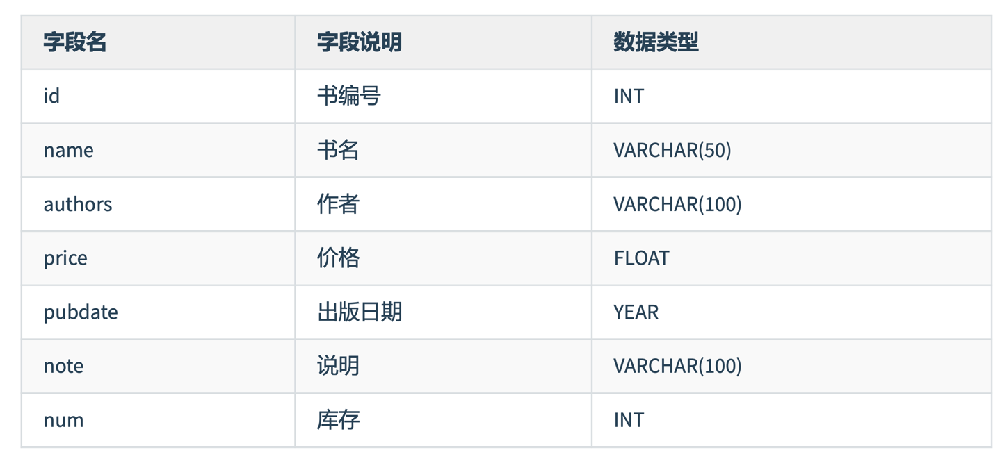
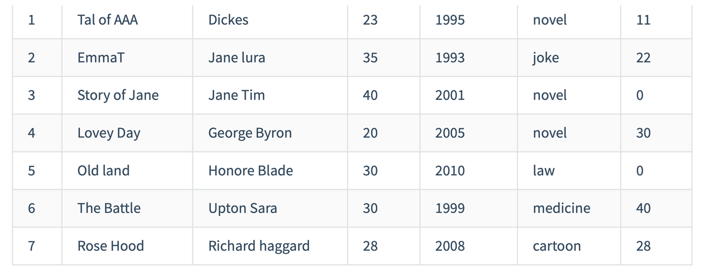
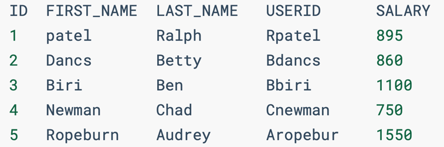
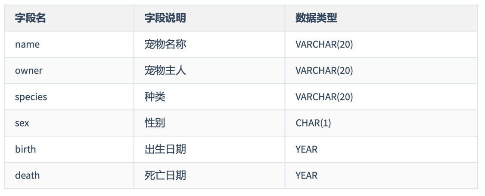
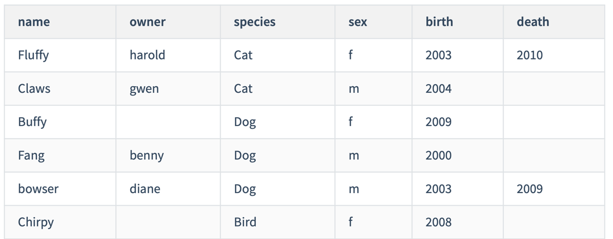
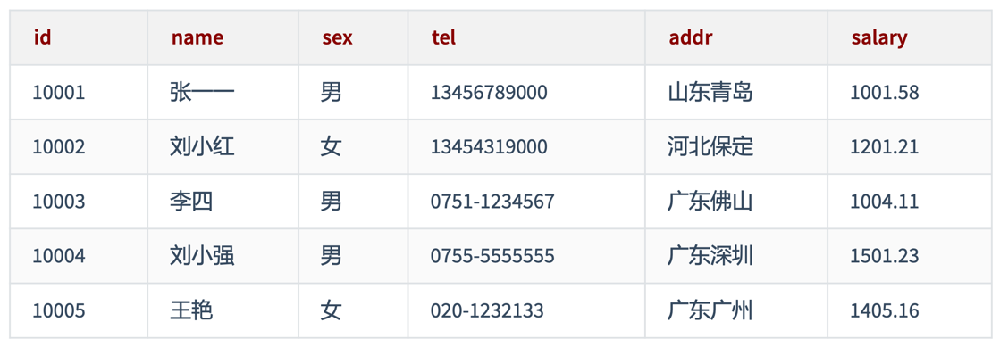

# 第11章 数据处理之增删改

> 55 DML之添加数据

```mysql
USE atguigudb;

CREATE TABLE IF NOT EXISTS emp1
(
    id        INT,
    name      VARCHAR(15),
    hire_date DATE,
    salary    DOUBLE(10, 2)
);

DESC emp1;

SELECT *
FROM emp1;

SHOW TABLES;
```

## 1. 添加数据

- 方式1: 一条一条地添加数据

```mysql
# 1️⃣没有指明添加到字段
INSERT INTO emp1
VALUES (1, 'Tom', '2000-12-21', 3400);
# 一定要按照声明的字段的先后顺序添加

# 错误的:
# INSERT INTO emp1
# VALUES (2, 3400, '2000-12-21', 'Jerry');

# 2️⃣指明要添加的字段 (推荐)
INSERT INTO emp1(id, hire_date, salary, name)
VALUES (2, '1999-09-09', 4000, 'Jerry');

# 说明: 没有进行赋值的hire_date的值为null
INSERT INTO emp1(id, salary, name)
VALUES (3, 4500, 'shk');

# 3️⃣一次性插入多条记录 (推荐)
INSERT INTO emp1 (id, name, salary)
VALUES (4, 'Jim', 5000),
       (5, '张俊杰', 5500);
```

- 方式2: 将查询结果插入到表中

```mysql
SELECT *
FROM emp1;

INSERT INTO emp1(id, name, salary, hire_date)
# 查询语句
SELECT employee_id, last_name, salary, hire_date # 查询的字段一定要与添加到的表的字段一一对应
FROM employees
WHERE department_id IN (60, 70);

DESC emp1;
DESC employees;

# 说明: emp1表中要添加数据的字段的长度不能低于employees表中查询的字段的长度。
# 如果emp1表中要添加数据的字段的长度低于employees表中查询的字段的长度，就有添加不成功的风险。
```

> 56 DML之更新删除操作 MySQL8新特性之计算列

## 2. 更新数据(或修改数据)

- UPDATE ... SET ... WHERE
- 可以实现批量修改数据

```mysql
UPDATE emp1
SET hire_date=CURDATE()
WHERE id = 5;

SELECT *
FROM emp1;

# 同时修改一条数据的多个字段
UPDATE emp1
SET hire_date=CURDATE(),
    salary=6000
WHERE id = 4;

# 题目: 将表中姓名中包含字符a的提薪20%。
UPDATE emp1
SET salary=salary * 1.2
WHERE name LIKE '%a%';

# 修改数据时，是可能存在不成功的情况的。(可能是由于约束的影响造成的)
UPDATE employees
SET department_id=10000
WHERE employee_id = 102;
```

## 3. 删除数据

- DELETE FROM ... WHERE ...

```mysql
DELETE
FROM emp1
WHERE id = 1;

SELECT *
FROM emp1;

# 在删除数据时，也有可能因为约束的影响，导致删除失败。
DELETE
FROM departments
WHERE department_id = 50;

# 小结: DML操作默认情况下，执行完以后都会自动提交数据。
# 如果希望执行完以后不自动提交数据，则需要使用SET AUTOCOMMIT = FALSE。
```

## 4. MySQL8的新特性: 计算列

```mysql
USE atguigudb;

CREATE TABLE test1
(
    a INT,
    b INT,
    c INT GENERATED ALWAYS AS (a + b) VIRTUAL # 字段c即为计算列
);

DESC test1;

INSERT INTO test1(a, b)
VALUES (10, 20);

SELECT *
FROM test1;

UPDATE test1
SET a=100;
```

> 57 DDL和DML的综合案例

## 5. 综合案例

```mysql
# 1. 创建数据库test01_library
CREATE DATABASE IF NOT EXISTS test01_library CHARACTER SET 'utf8';

SHOW DATABASES;

USE test01_library;

# 2. 创建表 books，表结构如下：
```



```mysql
CREATE TABLE IF NOT EXISTS books
(
    id      INT COMMENT '书编号',
    name    VARCHAR(50) COMMENT '书名',
    authors VARCHAR(100) COMMENT '作者',
    price   FLOAT COMMENT '价格',
    pubdate YEAR COMMENT '出版日期',
    note    VARCHAR(100) COMMENT '说明',
    num     INT COMMENT '库存'
);

SHOW TABLES;

DESC books;

# 3. 向books表中插入记录
# 1) 不指定字段名称，插入第一条记录
# 2) 指定所有字段名称，插入第二记录
# 3) 同时插入多条记录（剩下的所有记录）
```



```mysql
INSERT INTO books
VALUES (1, 'Tal of AAA', 'Dickes', 23, 1995, 'novel', 11);

INSERT INTO books (id, name, authors, price, pubdate, note, num)
VALUES (2, 'EmmaT', 'Jane lura', 35, 1993, 'joke', 22);

INSERT INTO books (id, name, authors, price, pubdate, note, num)
VALUES (3, 'Story of Jane', 'Jane Tim', 40, 2001, 'novel', 0),
       (4, 'Lovey Day', 'George Byron', 20, 2005, 'novel', 30),
       (5, 'Old land', 'Honore Blade', 30, 2010, 'law', 0),
       (6, 'The Battle', 'Upton Sara', 30, 1999, 'medicine', 40),
       (7, 'Rose Hood', 'Richard haggard', 28, 2008, 'cartoon', 28);

SELECT *
FROM books;

# 4. 将小说类型(novel)的书的价格都增加5。
UPDATE books
SET price=price + 5
WHERE note = 'novel';

# 5. 将名称为EmmaT的书的价格改为40，并将说明改为drama。
UPDATE books
SET price = 40,
    note='drama'
WHERE name = 'EmmaT';

# 6. 删除库存为0的记录。
DELETE
FROM books
WHERE num = 0;

# 7. 统计书名中包含a字母的书
SELECT name
FROM books
WHERE name LIKE '%a%';

# 8. 统计书名中包含a字母的书的数量和库存总量
SELECT COUNT(*), SUM(num)
FROM books
WHERE name LIKE '%a%';

# 9. 找出“novel”类型的书，按照价格降序排列
SELECT name, note, price
FROM books
WHERE note = 'novel'
ORDER BY price DESC;

# 10. 查询图书信息，按照库存量降序排列，如果库存量相同的按照note升序排列
SELECT *
FROM books
ORDER BY num DESC, note ASC;

# 11. 按照note分类统计书的数量
SELECT note, COUNT(*)
FROM books
GROUP BY note;

# 12. 按照note分类统计书的库存量，显示库存量超过30本的
SELECT note, SUM(num) sum_num
FROM books
GROUP BY note
HAVING sum_num > 30;

# 13. 查询所有图书，每页显示5本，显示第二页
SELECT *
FROM books
LIMIT 5,5;

# 14. 按照note分类统计书的库存量，显示库存量最多的
SELECT note, SUM(num) sum_num
FROM books
GROUP BY note
ORDER BY sum_num DESC
LIMIT 1;

# 15. 查询书名达到10个字符的书，不包括里面的空格
SELECT name
FROM books
WHERE CHAR_LENGTH(REPLACE(name, ' ', '')) >= 10;

# 16. 查询书名和类型，其中note值为novel显示小说，law显示法律，medicine显示医药，cartoon显示卡通，joke显示笑话
SELECT name                "书名",
       CASE note
           WHEN 'novel' THEN '小说'
           WHEN 'law' THEN '法律'
           WHEN 'medicine' THEN '医药'
           WHEN 'cartoon' THEN '卡通'
           WHEN 'joke' THEN '笑话'
           ELSE '其它' END "类型"
FROM books;

# 17. 查询书名、库存，其中num值超过30本的，显示滞销，大于0并低于10的，显示畅销，为0的显示需要无货
SELECT name AS             "书名",
       num  AS             "库存",
       CASE
           WHEN num > 30 THEN '滞销'
           WHEN num > 0 AND num < 10 THEN '畅销'
           WHEN num = 0 THEN '无货'
           ELSE '正常' END "销售情况"
FROM books;

# 18. 统计每一种note的库存量，并合计总量
SELECT IFNULL(note, '合计库存总量') AS note, SUM(num)
FROM books
GROUP BY note
WITH ROLLUP;

# 19. 统计每一种note的数量，并合计总量
SELECT IFNULL(note, '合计总量') AS note, COUNT(*)
FROM books
GROUP BY note
WITH ROLLUP;

# 20. 统计库存量前三名的图书
SELECT *
FROM books
ORDER BY num DESC
LIMIT 0,3;

# 21. 找出最早出版的一本书
SELECT *
FROM books
ORDER BY pubdate
LIMIT 1;

# 22. 找出novel中价格最高的一本书
SELECT *
FROM books
WHERE note = 'novel'
ORDER BY price DESC
LIMIT 1;

# 23. 找出书名中字数最多的一本书，不含空格
SELECT *
FROM books
ORDER BY CHAR_LENGTH(REPLACE(name, ' ', '')) DESC
LIMIT 1;
```

> 58 第11章 增删改 课后练习

## 课后练习

```mysql
# 练习1
# 1. 创建数据库dbtest11
CREATE DATABASE IF NOT EXISTS dbtest11 CHARACTER SET 'utf8';

USE dbtest11;

# 2. 运行以下脚本创建表my_employees
CREATE TABLE IF NOT EXISTS my_employees
(
    id         INT(10),
    first_name VARCHAR(10),
    last_name  VARCHAR(10),
    userid     VARCHAR(10),
    salary     DOUBLE(10, 2)
);

CREATE TABLE IF NOT EXISTS users
(
    id            INT,
    userid        VARCHAR(10),
    department_id INT
);

SHOW TABLES;

# 3. 显示表my_employees的结构
DESC my_employees;

# 4. 向my_employees表中插入下列数据
```



```mysql
# 方式1:
INSERT INTO my_employees(id, first_name, last_name, userid, salary)
VALUES (1, 'patel', 'Ralph', 'Rpatel', 895),
       (2, 'Dancs', 'Betty', 'Bdancs', 860),
       (3, 'Biri', 'Ben', 'Bbiri', 1100),
       (4, 'Newman', 'Chad', 'Cnewman', 750),
       (5, 'Ropeburn', 'Audrey', 'Aropebur', 1550);

# 方式2:
INSERT INTO my_employees(id, first_name, last_name, userid, salary)
SELECT 1, 'patel', 'Ralph', 'Rpatel', 895
UNION ALL
SELECT 2, 'Dancs', 'Betty', 'Bdancs', 860
UNION ALL
SELECT 3, 'Biri', 'Ben', 'Bbiri', 1100
UNION ALL
SELECT 4, 'Newman', 'Chad', 'Cnewman', 750
UNION ALL
SELECT 5, 'Ropeburn', 'Audrey', 'Aropebur', 1550;

SELECT *
FROM my_employees;

# 5. 向users表中插入数据
```


```mysql
INSERT INTO users(id, userid, department_id)
VALUES (1, 'Rpatel', 10),
       (2, 'Bdancs', 10),
       (3, 'Bbiri', 20),
       (4, 'Cnewman', 30),
       (5, 'Aropebur', 40);

SELECT *
FROM users;

# 6. 将3号员工的last_name修改为“drelxer”
UPDATE my_employees
SET last_name='drelxer'
WHERE id = 3;

SELECT *
FROM my_employees;

# 7. 将所有工资少于900的员工的工资修改为1000
UPDATE my_employees
SET salary=1000
WHERE salary < 900;

SELECT *
FROM my_employees;

# 8. 将userid为Bbiri的user表和my_employees表的记录全部删除
# 方式1:
DELETE
FROM users
WHERE userid = 'Bbiri';

DELETE
FROM my_employees
WHERE userid = 'Bbiri';

# 方式2:
DELETE m,u
FROM my_employees m
         JOIN users u
              ON m.userid = u.userid
WHERE m.userid = 'Bbiri';

SELECT *
FROM my_employees;

SELECT *
FROM users;

# 9. 删除my_employees、users表所有数据
DELETE
FROM my_employees;

DELETE
FROM users;

# 10. 检查所作的修正
SELECT *
FROM my_employees;

SELECT *
FROM users;

# 11. 清空表my_employees
TRUNCATE TABLE my_employees;

SELECT *
FROM my_employees;

##############################
# 练习2
# 1. 使用现有数据库dbtest11
USE dbtest11;

# 2. 创建表格pet
```



```mysql
CREATE TABLE IF NOT EXISTS pet
(
    name    VARCHAR(20) COMMENT '宠物名称',
    owner   VARCHAR(20) COMMENT '宠物主人',
    species VARCHAR(20) COMMENT '种类',
    sex     CHAR(1) COMMENT '性别',
    birth   YEAR COMMENT '出生日期',
    death   YEAR COMMENT '死亡日期'
);

SHOW TABLES;

DESC pet;

# 3. 添加记录
```



```mysql
INSERT INTO pet (name, owner, species, sex, birth, death)
VALUES ('Fluffy', 'harold', 'Cat', 'f', '2003', '2010'),
       ('Claws', 'gwen', 'Cat', 'm', '2004', NULL),
       ('Buffy', NULL, 'Dog', 'f', '2009', NULL),
       ('Fang', 'benny', 'Dog', 'm', '2000', NULL),
       ('bowser', 'diane', 'Dog', 'm', '2003', '2009'),
       ('Chirpy', NULL, 'Bird', 'f', '2008', NULL);

SELECT *
FROM pet;

# 4. 添加字段:主人的生日owner_birth DATE类型。
DESC pet;

ALTER TABLE pet
    ADD COLUMN owner_birth DATE AFTER owner;

DESC pet;

# 5. 将名称为Claws的猫的主人改为kevin
UPDATE pet
SET owner='kevin'
WHERE name = 'Claws'
  AND species = 'Cat';

SELECT *
FROM pet;

# 6. 将没有死的狗的主人改为duck
UPDATE pet
SET owner='duck'
WHERE species = 'Dog'
  AND death IS NULL;

SELECT *
FROM pet;

# 7. 查询没有主人的宠物的名字；
SELECT name
FROM pet
WHERE owner IS NULL;

# 8. 查询已经死了的cat的姓名，主人，以及去世时间；
SELECT name, owner, death
FROM pet
WHERE species = 'cat'
  AND death IS NOT NULL;

# 9. 删除已经死亡的狗
SELECT *
FROM pet;

DELETE
FROM pet
WHERE species = 'Dog'
  AND death IS NOT NULL;

SELECT *
FROM pet;

# 10. 查询所有宠物信息
SELECT *
FROM pet;

##############################
# 练习3
# 1. 使用已有的数据库dbtest11
USE dbtest11;

# 2. 创建表employee，并添加记录
```


```mysql
CREATE TABLE IF NOT EXISTS employee
(
    id     INT,
    name   VARCHAR(15),
    sex    CHAR(1),
    tel    VARCHAR(25),
    addr   VARCHAR(35),
    salary DOUBLE(10, 2)
);

DESC employee;

INSERT INTO employee (id, name, sex, tel, addr, salary)
VALUES (10001, '张一一', '男', '13456789000', '山东青岛', 1001.58),
       (10002, '刘小红', '女', '13454319000', '河北保定', 1201.21),
       (10003, '李四', '男', '0751-1234567', '广东佛山', 1004.11),
       (10004, '刘小强', '男', '0755-5555555', '广东深圳', 1501.23),
       (10005, '王艳', '女', '020-1232133', '广东广州', 1405.16);

SELECT *
FROM employee;

# 3. 查询出薪资在1200~1300之间的员工信息。
SELECT *
FROM employee
WHERE salary BETWEEN 1200 AND 1300;

# 4. 查询出姓“刘”的员工的工号，姓名，家庭住址。
SELECT id, name, addr
FROM employee
WHERE name LIKE '刘%';

# 5. 将“李四”的家庭住址改为“广东韶关”
UPDATE employee
SET addr='广东韶关'
WHERE name = '李四';

SELECT *
FROM employee;

# 6. 查询出名字中带“小”的员工
SELECT *
FROM employee
WHERE name LIKE '%小%';
```

