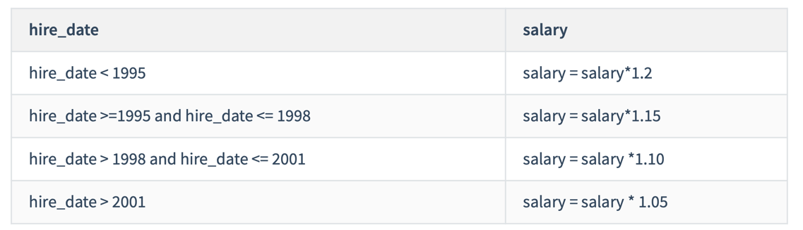

# 第16章 变量、流程控制与游标

> 83 GLOBAL与SESSION系统变量的使用

## 1. 变量

### 1.1 变量: 系统变量(全局系统变量、会话系统变量) VS 用户自定义变量

### 1.2 查看系统变量

```mysql
# 查询全局系统变量
SHOW GLOBAL VARIABLES;
# 624

# 查询会话系统变量
SHOW SESSION VARIABLES;
# 648

# 默认查询的是会话系统变量
SHOW VARIABLES;

# 查询部分系统变量
SHOW GLOBAL VARIABLES LIKE 'admin_%';

SHOW VARIABLES LIKE 'character_%';
```

### 1.3 查看指定系统变量

```mysql
SELECT @@global.max_connections;
SELECT @@global.character_set_client;

# 错误: Variable 'pseudo_thread_id' is a SESSION variable
SELECT @@global.pseudo_thread_id;

# 错误: Variable 'max_connections' is a GLOBAL variable
# SELECT @@session.max_connections;

SELECT @@session.character_set_client;

SELECT @@session.pseudo_thread_id;

SELECT @@character_set_client; # 先查询会话系统变量，再查询全局系统变量。
```

### 1.4 修改系统变量的值

```mysql
# 全局系统变量:
# 方式1:
SET @@global.max_connections = 161;

# 方式2:
SET GLOBAL MAX_CONNECTIONS = 171;

# 针对于当前的数据库实例是有效的，一旦重启mysql服务，就失效了。

# 会话系统变量:
# 方式1:
SET @@session.character_set_client = 'gbk';

# 方式2:
SET SESSION CHARACTER_SET_CLIENT = 'gbk';

# 针对于当前会话是有效的，一旦结束会话，重新建立起新的会话，就失效了。
```

> 84 会话用户变量与局部变量的使用

### 1.5 用户变量

```mysql
# 1️⃣ 用户变量: 会话用户变量 VS 局部变量
# 2️⃣ 会话用户变量: 使用"@"开头，作用域为当前会话。
# 3️⃣ 局部变量: 是能使用在存储过程和存储函数中。
```

### 1.6 会话用户变量

```mysql
# 1️⃣ 变量的声明和赋值:
# 方式1: "="或":="
# SET @用户变量 = 值;
# SET @用户变量 := 值;

# 方式2: ":="或INTO关键字
# SELECT @用户变量 := 表达式 [FROM 等字句]
# SELECT 表达式 INTO @用户变量 [FROM 等字句]

# 2️⃣ 使用
# SELECT @变量名;

# 准备工作
CREATE DATABASE IF NOT EXISTS dbtest16;

USE dbtest16;

CREATE TABLE IF NOT EXISTS employees
AS
SELECT *
FROM atguigudb.employees;

CREATE TABLE IF NOT EXISTS departments
AS
SELECT *
FROM atguigudb.departments;

SELECT *
FROM employees;

SELECT *
FROM departments;

# 测试
# 方式1:
SET @m1 = 1;
SET @m2 := 2;
SET @sum := @m1 + @m2;

SELECT @sum;

# 方式2:
SELECT @count := COUNT(*)
FROM employees;

SELECT @count;

SELECT AVG(salary)
INTO @avg_sal
FROM employees;

SELECT @avg_sal;
```

### 1.7 局部变量

```mysql
# 1. 局部变量必须满足:
# 1️⃣ 使用DECLARE声明 
# 2️⃣ 声明并使用在BEGIN ... END中 (使用在存储过程、函数中)
# 3️⃣ DECLARE声明的局部变量必须声明在BEGIN中的首行

# 2. 声明格式:
# DECLARE 变量名 类型 [DEFAULT 值]; # 如果没有DEFAULT子句，初始值为NULL。

# 3. 赋值:
# 方式1:
# SET 变量名 = 值;
# SET 变量名 := 值;

# 方式2:
# SELECT 字段名或表达式 INTO 变量名 FROM 表;

# 4. 使用:
# SELECT 局部变量名;

# 举例:
DELIMITER //

CREATE PROCEDURE IF NOT EXISTS test_var()
BEGIN
    # 1. 声明局部变量
    DECLARE a INT DEFAULT 0;
    DECLARE b INT;
    # DECLARE a, b INT DEFAULT 0; # 如果局部变量的类型和默认值相同，则可以将多个声明语句合并。
    DECLARE emp_name VARCHAR(25);

    # 2. 赋值
    SET a = 1;
    SET b := 2;
    SELECT last_name INTO emp_name FROM employees WHERE employee_id = 101;

    # 3. 使用
    SELECT a, b, emp_name;
END //

DELIMITER ;

# 调用存储过程
CALL test_var();

# 举例1: 声明局部变量，并分别赋值为employees表中employee_id为102的last_name和salary。
DESC employees;

DELIMITER //

CREATE PROCEDURE IF NOT EXISTS show_name_salary()
BEGIN
    # 声明
    DECLARE emp_name VARCHAR(25);
    DECLARE emp_salary DOUBLE(10, 2) DEFAULT 0.0;

    # 赋值
    SELECT last_name, salary INTO emp_name,emp_salary FROM employees WHERE employee_id = 102;

    # 使用
    SELECT emp_name, emp_salary;
END //

DELIMITER ;

# 调用
CALL show_name_salary();

SELECT last_name, salary
FROM employees
WHERE employee_id = 102;

# 举例2: 声明两个变量，求和并打印 (分别使用会话用户变量、局部变量的方式实现)。
# 方式1: 使用会话用户变量
SET @num1 := 10;
SET @num2 := 20;
SET @sum := @num1 + @num2;

# 查看
SELECT @sum;

# 方式2: 使用局部变量
DELIMITER //

CREATE PROCEDURE IF NOT EXISTS test_sum()
BEGIN
    # 声明
    DECLARE num1 INT;
    DECLARE num2 INT;
    DECLARE sum_val INT;

    # 赋值
    SET num1 := 14;
    SET num2 := 15;
    SET sum_val := num1 + num2;

    # 使用
    SELECT sum_val;
END //

DELIMITER ;

# 调用
CALL test_sum();

# 举例3: 创建存储过程“different_salary”查询某员工和他领导的薪资差距，并用IN参数emp_id接收员工id，用OUT参数dif_salary输出薪资差距结果。
DELIMITER //

CREATE PROCEDURE IF NOT EXISTS different_salary(IN emp_id INT, OUT dif_salary DOUBLE)
BEGIN
    # 分析: 查询出emp_id员工的工资；查询出emp_id员工的管理者的id；查询管理者的工资；计算两个工资的差值。
    # 声明变量
    DECLARE emp_salary, mgr_salary DOUBLE DEFAULT 0.0; # 记录员工和管理者的工资
    DECLARE mgr_id INT DEFAULT 0; # 记录管理者的id

    SELECT salary, manager_id INTO emp_salary, mgr_id FROM employees WHERE employee_id = emp_id;

    SELECT salary INTO mgr_salary FROM employees WHERE employee_id = mgr_id;

    SET dif_salary = mgr_salary - emp_salary;
    # SELECT (mgr_salary - emp_salary) INTO dif_salary;
END //

DELIMITER ;

# 调用
SET @emp_id := 102;
CALL different_salary(@emp_id, @dif_salary);

SELECT @dif_salary;

# 验证结果
SELECT *
FROM employees
WHERE employee_id = 102; # salary: 17000, manager_id: 100

SELECT *
FROM employees
WHERE employee_id = 100; # salary: 24000
```

> 85 程序出错的处理机制

## 2. 定义条件和处理程序

### 2.1 错误演示

```mysql
# 演示
# 错误代码: 1364
# Field 'email' doesn't have a default value
INSERT INTO employees(last_name)
VALUES ('Tom');

DESC employees;

# 错误演示
DELIMITER //

CREATE PROCEDURE IF NOT EXISTS UpdateDataNoCondition()
BEGIN
    SET @x = 1;
    UPDATE employees SET email=NULL WHERE last_name = 'Abel';
    SET @x = 2;
    UPDATE employees SET email='aabbel' WHERE last_name = 'Abel';
    SET @x = 3;
END //

DELIMITER ;

# 调用存储过程
# 错误代码: 1048
# Column 'email' cannot be null
CALL UpdateDataNoCondition();

SELECT @x;
```

### 2.2 定义条件

```mysql
# 格式: DECLARE 错误名称 CONDITION FOR 错误码(或错误条件)

# 举例1: 定义“Field_Not_Be_NULL”错误名与MySQL中违反非空约束的错误类型是“ERROR 1048 (23000)”对应。
# 方式1: 使用MySQL_error_code。
# DECLARE Field_Not_Be_NULL CONDITION FOR 1048;

# 方式2: 使用sqlstate_value。
# DECLARE Field_Not_Be_NULL CONDITION FOR SQLSTATE '23000';

# 举例2：定义"ERROR 1148(42000)"错误，名称为command_not_allowed。
# 方式1: 使用MySQL_error_code。
# DECLARE command_not_allowed CONDITION FOR 1148;

# 方式2: 使用sqlstate_value。
# DECLARE command_not_allowed CONDITION FOR SQLSTATE '42000';
```

### 2.3 定义处理程序

```mysql
# 格式: DECLARE 处理方式 HANDLER FOR 错误类型 处理语句

# 方法1：捕获sqlstate_value
# DECLARE CONTINUE HANDLER FOR SQLSTATE '42S02' SET @info = 'NO_SUCH_TABLE';

# 方法2：捕获mysql_error_value
# DECLARE CONTINUE HANDLER FOR 1146 SET @info = 'NO_SUCH_TABLE';

# 方法3：先定义条件，再调用
# DECLARE no_such_table CONDITION FOR 1146;
# DECLARE CONTINUE HANDLER FOR NO_SUCH_TABLE SET @info = 'NO_SUCH_TABLE';

# 方法4：使用SQLWARNING
# DECLARE EXIT HANDLER FOR SQLWARNING SET @info = 'ERROR';

# 方法5：使用NOT FOUND
# DECLARE EXIT HANDLER FOR NOT FOUND SET @info = 'NO_SUCH_TABLE';

# 方法6：使用SQLEXCEPTION
# DECLARE EXIT HANDLER FOR SQLEXCEPTION SET @info = 'ERROR';
```

### 2.4 案例的处理

```mysql
DROP PROCEDURE IF EXISTS UpdateDataNoCondition;

# 重新定义存储过程，体现错误的处理程序。
DELIMITER //

CREATE PROCEDURE IF NOT EXISTS UpdateDataNoCondition()
BEGIN
    # 声明处理程序
    # 处理方式1:
    DECLARE CONTINUE HANDLER FOR 1048 SET @prc_value = -1;
    # 处理方式2:
    # DECLARE CONTINUE HANDLER FOR SQLSTATE '23000' SET @prc_value = -1;

    SET @x = 1;
    UPDATE employees SET email=NULL WHERE last_name = 'Abel';
    SET @x = 2;
    UPDATE employees SET email='aabbel' WHERE last_name = 'Abel';
    SET @x = 3;
END //

DELIMITER ;

# 调用存储过程
CALL UpdateDataNoCondition();

# 查询变量
SELECT @x, @prc_value;
```

### 2.5 再举一个例子:

```mysql
# 创建一个名称为"InsertDataWithCondition"的存储过程

# 1️⃣ 准备工作:
CREATE TABLE IF NOT EXISTS departments
AS
SELECT *
FROM atguigudb.departments;

DESC departments;

ALTER TABLE departments
    ADD CONSTRAINT uk_dept_name UNIQUE (department_id);

# 2️⃣ 定义存储过程:
DELIMITER //

CREATE PROCEDURE IF NOT EXISTS InsertDataWithCondition()
BEGIN
    SET @x = 1;
    INSERT INTO departments(department_name)
    VALUES ('测试');
    SET @x = 2;
    INSERT INTO departments(department_name)
    VALUES ('测试');
    SET @x = 3;
END //

DELIMITER ;

# 3️⃣ 调用
CALL InsertDataWithCondition();

SELECT @x;
# 2

# 4️⃣ 删除此存储过程
DROP PROCEDURE IF EXISTS InsertDataWithCondition;

# 5️⃣ 重新定义存储过程(考虑到错误的处理程序)
DELIMITER //

CREATE PROCEDURE IF NOT EXISTS InsertDataWithCondition()
BEGIN
    # 处理程序
    # 方式1:
    # DECLARE EXIT HANDLER FOR 1062 SET @pro_value = -1;
    # 方式2:
    # DECLARE EXIT HANDLER FOR SQLSTATE '23000' SET @pro_value = -1;
    # 方式3:
    # 定义条件
    DECLARE duplicate_entry CONDITION FOR 1062;
    DECLARE EXIT HANDLER FOR duplicate_entry SET @pro_value = -1;

    SET @x = 1;
    INSERT INTO departments(department_name)
    VALUES ('测试');
    SET @x = 2;
    INSERT INTO departments(department_name)
    VALUES ('测试');
    SET @x = 3;
END //

DELIMITER ;

# 调用
CALL InsertDataWithCondition();

SELECT @x, @pro_value;
```

> 86 分支结构IF的使用

## 3. 流程控制之分支结构

### 3.1 分支结构之 IF

```mysql
# 举例1:
DELIMITER //

CREATE PROCEDURE IF NOT EXISTS test_if()
BEGIN
    # 情况1:
    # 声明局部变量
    # DECLARE stu_name VARCHAR(15);

    # IF stu_name IS NULL
    # THEN
    #     SELECT 'stu_name is NULL';
    # END IF;

    # 情况2: 二选一
    # DECLARE email VARCHAR(25) DEFAULT 'aaa';

    # IF email IS NULL
    # THEN
    #     SELECT 'email is NULL';
    # ELSE
    #     SELECT 'email is not NULL';
    # END IF;

    # 情况3: 多选一
    DECLARE age INT DEFAULT 20;

    IF age > 40 THEN
        SELECT '中老年';
    ELSEIF age > 18 THEN
        SELECT '青壮年';
    ELSEIF age > 8 THEN
        SELECT '青少年';
    ELSE
        SELECT '婴幼儿';
    END IF;
END //

DELIMITER ;

# 调用
CALL test_if();

DROP PROCEDURE IF EXISTS test_if;

# 举例2: 声明存储过程“update_salary_by_eid1”，定义IN参数emp_id，输入员工编号。判断该员工
# 薪资如果低于8000元并且入职时间超过5年，就涨薪500元; 否则就不变。
DELIMITER //

CREATE PROCEDURE IF NOT EXISTS update_salary_by_eid1(IN emp_id INT)
BEGIN
    # 声明局部变量
    DECLARE emp_salary DOUBLE DEFAULT 0.0; # 记录员工的工资
    DECLARE hire_year DOUBLE;
    # 记录员工入职公司的年头

    # 赋值
    SELECT salary, DATEDIFF(CURDATE(), hire_date) / 365
    INTO emp_salary,hire_year
    FROM employees
    WHERE employee_id = emp_id;

    IF emp_salary < 8000 AND hire_year >= 5
    THEN
        UPDATE employees SET salary=salary + 500 WHERE employee_id = emp_id;
    END IF;
END //

DELIMITER ;

# 调用存储过程
SET @emp_id := 104;
CALL update_salary_by_eid1(@emp_id);

SELECT employee_id, salary, hire_date
FROM employees;

# 举例3：声明存储过程“update_salary_by_eid2”，定义IN参数emp_id，输入员工编号。判断该员工
# 薪资如果低于9000元并且入职时间超过5年，就涨薪500元；否则就涨薪100元。
DELIMITER //

CREATE PROCEDURE IF NOT EXISTS update_salary_by_eid2(IN emp_id INT)
BEGIN
    # 定义局部变量
    DECLARE emp_salary DOUBLE;
    DECLARE hire_year DOUBLE;

    # 赋值
    SELECT salary INTO emp_salary FROM employees WHERE employee_id = emp_id;

    SELECT DATEDIFF(CURDATE(), hire_date) / 365 INTO hire_year FROM employees WHERE employee_id = emp_id;

    IF emp_salary < 9000 AND hire_year >= 5
    THEN
        UPDATE employees SET salary=salary + 500 WHERE employee_id = emp_id;
    ELSE
        UPDATE employees SET salary=salary + 100 WHERE employee_id = emp_id;
    END IF;
END //

DELIMITER ;

# 调用存储过程
CALL update_salary_by_eid2(102);

SELECT employee_id, salary, hire_date
FROM employees;

# 举例4：声明存储过程“update_salary_by_eid3”，定义IN参数emp_id，输入员工编号。判断该员工
# 薪资如果低于9000元，就更新薪资为9000元；薪资如果大于等于9000元且低于10000的，但是奖金
# 比例为NULL的，就更新奖金比例为0.01；其他的涨薪100元。
DELIMITER //

CREATE PROCEDURE IF NOT EXISTS update_salary_by_eid3(IN emp_id INT)
BEGIN
    # 声明局部变量
    DECLARE emp_salary DOUBLE; # 记录员工的工资
    DECLARE emp_commission_pct DOUBLE;
    # 记录员工的奖金率

    # 赋值
    SELECT salary, commission_pct INTO emp_salary, emp_commission_pct FROM employees WHERE employee_id = emp_id;

    # 判断
    IF emp_salary < 9000
    THEN
        UPDATE employees SET salary=9000 WHERE employee_id = emp_id;
    ELSEIF emp_salary < 10000 AND emp_commission_pct IS NULL
    THEN
        UPDATE employees SET commission_pct=0.01 WHERE employee_id = emp_id;
    ELSE
        UPDATE employees SET salary=salary + 100 WHERE employee_id = emp_id;
    END IF;
END //

DELIMITER ;

# 调用存储过程
CALL update_salary_by_eid3(104);
CALL update_salary_by_eid3(108);

SELECT employee_id, salary, commission_pct
FROM employees;
```

> 87 分支结构CASE的使用

### 3.2 分支结构之 CASE

```mysql
# 举例1: 基本使用
DELIMITER //

CREATE PROCEDURE IF NOT EXISTS test_case()
BEGIN
    # 演示1: CASE ... WHEN ... THEN ...
    /*
    DECLARE var INT DEFAULT 2;

    CASE var
        WHEN 1 THEN SELECT 'var = 1';
        WHEN 2 THEN SELECT 'var = 2';
        WHEN 3 THEN SELECT 'var = 3';
        ELSE SELECT 'other value';
        END CASE;
     */

    # 演示2: CASE WHEN ... THEN ...
    DECLARE var1 INT DEFAULT 10;
    CASE
        WHEN var1 > 100 THEN SELECT '三位数';
        WHEN var1 >= 10 THEN SELECT '两位数';
        ELSE SELECT '个位数';
        END CASE;
END //

DELIMITER ;

DROP PROCEDURE IF EXISTS test_case;

# 调用
CALL test_case();

# 举例2: 声明存储过程“update_salary_by_eid4”，定义IN参数emp_id，输入员工编号。判断该员工
# 薪资如果低于9000元，就更新薪资为9000元；薪资大于等于9000元且低于10000的，但是奖金比例
# 为NULL的，就更新奖金比例为0.01；其他的涨薪100元。
DELIMITER //

CREATE PROCEDURE IF NOT EXISTS update_salary_by_eid4(IN emp_id INT)
BEGIN
    # 定义局部变量
    DECLARE emp_salary DOUBLE; # 记录员工的工资
    DECLARE emp_commission_pct DOUBLE;
    # 记录员工的奖金率

    # 赋值
    SELECT salary, commission_pct INTO emp_salary, emp_commission_pct FROM employees WHERE employee_id = emp_id;

    # 判断
    CASE
        WHEN emp_salary < 9000
            THEN UPDATE employees SET salary=9000 WHERE employee_id = emp_id;
        WHEN emp_salary < 10000 AND emp_commission_pct IS NULL
            THEN UPDATE employees SET commission_pct=0.01 WHERE employee_id = emp_id;
        ELSE UPDATE employees SET salary=salary + 100 WHERE employee_id = emp_id;
        END CASE;
END //

DELIMITER ;

# 调用
CALL update_salary_by_eid4(103);
CALL update_salary_by_eid4(104);
CALL update_salary_by_eid4(105);

DROP PROCEDURE IF EXISTS update_salary_by_eid4;

SELECT *
FROM employees
WHERE employee_id IN (103, 104, 105);

# 举例3: 声明存储过程update_salary_by_eid5，定义IN参数emp_id，输入员工编号。判断该员工的
# 入职年限，如果是0年，薪资涨50；如果是1年，薪资涨100；如果是2年，薪资涨200；如果是3年，
# 薪资涨300；如果是4年，薪资涨400；其他的涨薪500。
DELIMITER //

CREATE PROCEDURE IF NOT EXISTS update_salary_by_eid5(IN emp_id INT)
BEGIN
    # 定义局部变量
    DECLARE hire_year INT;
    # 记录员工入职公司的总时间(单位: 年)

    # 赋值
    SELECT ROUND(DATEDIFF(CURDATE(), hire_date) / 365) INTO hire_year FROM employees WHERE employee_id = emp_id;

    # 判断
    CASE hire_year
        WHEN 0
            THEN UPDATE employees SET salary=salary + 50 WHERE employee_id = emp_id;
        WHEN 1
            THEN UPDATE employees SET salary=salary + 100 WHERE employee_id = emp_id;
        WHEN 2
            THEN UPDATE employees SET salary=salary + 200 WHERE employee_id = emp_id;
        WHEN 3
            THEN UPDATE employees SET salary=salary + 300 WHERE employee_id = emp_id;
        WHEN 4
            THEN UPDATE employees SET salary=salary + 400 WHERE employee_id = emp_id;
        ELSE UPDATE employees SET salary=salary + 500 WHERE employee_id = emp_id;
        END CASE;
END //

DELIMITER ;

# 调用
CALL update_salary_by_eid5(101);

SELECT employee_id, salary, hire_date
FROM employees;
```

> 88 LOOP WHILE REPEAT三种循环结构

## 4. 流程控制之循环结构

### 4.1 循环结构之LOOP

```mysql
# [loop_label:] LOOP
#     循环执行的语句
# END LOOP [loop_label]

# 举例1:
DELIMITER //

CREATE PROCEDURE IF NOT EXISTS test_loop()
BEGIN
    # 声明局部变量
    DECLARE num INT DEFAULT 1;

    loop_label:
    LOOP
        # 重新赋值
        SET num = num + 1;

        # 可以考虑某个代码程序反复执行。(略)

        IF num >= 10 THEN
            LEAVE loop_label ;
        END IF;
    END LOOP loop_label;

    # 查看num
    SELECT num;
END //

DELIMITER ;

# 调用
CALL test_loop();

# 举例2: 当市场环境变好时，公司为了奖励大家，决定给大家涨工资。声明存储过程
# “update_salary_loop()”，声明OUT参数num，输出循环次数。存储过程中实现循环给大家涨薪，薪资涨为
# 原来的1.1倍。直到全公司的平均薪资达到12000结束。并统计循环次数。
DELIMITER //

CREATE PROCEDURE IF NOT EXISTS update_salary_loop(OUT num INT)
BEGIN
    # 声明局部变量
    DECLARE avg_sal DOUBLE; # 记录员工的平均工资
    DECLARE times INT DEFAULT 0;
    # 记录循环的次数

    # 1️⃣ 初始化条件
    # 获取员工的平均工资
    SELECT AVG(salary)
    INTO avg_sal
    FROM employees;

    loop_label:
    LOOP
        # 2️⃣ 循环条件
        # 结束循环的条件
        IF avg_sal >= 12000
        THEN
            LEAVE loop_label;
        END IF;

        # 3️⃣ 循环体
        # 如果低于12000，更新员工的工资
        UPDATE employees SET salary=salary * 1.1;

        # 4️⃣ 迭代条件
        # 更新avg_sal变量的值
        SELECT AVG(salary) INTO avg_sal FROM employees;
        # 记录循环次数
        SET times = times + 1;
    END LOOP loop_label;

    # 给num赋值
    SET num = times;
END //

DELIMITER ;

SELECT AVG(salary)
FROM employees;

# 调用
CALL update_salary_loop(@num);

DROP PROCEDURE IF EXISTS update_salary_loop;

SELECT @num;
```

### 4.2 循环结构之WHILE

```mysql
# [while_label:] WHILE 循环条件 DO
# 循环体
# END WHILE [while_label];

# 举例1:
DELIMITER //

CREATE PROCEDURE IF NOT EXISTS test_while()
BEGIN
    # 初始化条件
    DECLARE num INT DEFAULT 1;

    # 循环条件
    WHILE num <= 10
        DO
        # 循环体(略)

        # 迭代条件
            SET num = num + 1;
        END WHILE;

    SELECT num;
END //

DELIMITER ;

DROP PROCEDURE IF EXISTS test_while;

CALL test_while();

# 举例2: 市场环境不好时，公司为了渡过难关，决定暂时降低大家的薪资。声明存储过程
# “update_salary_while()”，声明OUT参数num，输出循环次数。存储过程中实现循环给大家降薪，薪资降
# 为原来的90%。直到全公司的平均薪资达到5000结束。并统计循环次数。
DELIMITER //

CREATE PROCEDURE IF NOT EXISTS update_salary_while(OUT num INT)
BEGIN
    # 定义局部变量
    DECLARE avg_sal DOUBLE; # 记录平均工资
    DECLARE while_count INT DEFAULT 0;
    # 记录循环次数

    # 赋值
    SELECT AVG(salary) INTO avg_sal FROM employees;

    WHILE avg_sal > 5000
        DO
            UPDATE employees SET salary=salary * 0.9;

            SELECT AVG(salary) INTO avg_sal FROM employees;

            SET while_count = while_count + 1;
        END WHILE;
    # 给num赋值
    SET num = while_count;
END //

DELIMITER ;

# 调用
SELECT AVG(salary)
FROM employees;

CALL update_salary_while(@num);
SELECT @num;
```

```mysql
/*
凡是循环结构，一定具备4个要素:
1. 初始化条件
2. 循环条件
3. 循环体
4. 迭代条件
*/
```

### 4.3 循环结构之REPEAT

```mysql
# [repeat_label:] REPEAT
# 循环体的语句
# UNTIL 结束循环的条件表达式
# END REPEAT [repeat_label]

# 举例1:
DELIMITER //

CREATE PROCEDURE test_repeat()
BEGIN
    # 声明局部变量
    DECLARE num INT DEFAULT 1;

    REPEAT
        SET num = num + 1;
    UNTIL num >= 10
        END REPEAT;

    # 查看
    SELECT num;
END //

DELIMITER ;

# 调用
CALL test_repeat();

# 举例2: 当市场环境变好时，公司为了奖励大家，决定给大家涨工资。声明存储过程
# “update_salary_repeat()”，声明OUT参数num，输出循环次数。存储过程中实现循环给大家涨薪，薪资涨
# 为原来的1.15倍。直到全公司的平均薪资达到13000结束。并统计循环次数。
DELIMITER //

CREATE PROCEDURE IF NOT EXISTS update_salary_repeat(OUT num INT)
BEGIN
    # 声明局部变量
    DECLARE avg_sal DOUBLE; # 记录平均工资
    DECLARE repeat_count INT DEFAULT 0;
    # 记录循环次数

    # 赋值
    SELECT AVG(salary) INTO avg_sal FROM employees;

    REPEAT
        UPDATE employees SET salary=salary * 1.15;
        SET repeat_count = repeat_count + 1;

        SELECT AVG(salary) INTO avg_sal FROM employees;
    UNTIL avg_sal >= 13000 END REPEAT;

    # 给num赋值
    SET num = repeat_count;
END //

DELIMITER ;

SELECT AVG(salary)
FROM employees;

# 调用
CALL update_salary_repeat(@num);

SELECT @num;
```

> 89 LEAVE和ITERATE的使用

## 5. 流程控制之跳转语句

### 5.1 LEAVE的使用

```mysql
# 举例1: 创建存储过程 “leave_begin()”，声明INT类型的IN参数num。给BEGIN...END加标记名，并在
# BEGIN...END中使用IF语句判断num参数的值。
#     如果num<=0，则使用LEAVE语句退出BEGIN...END；
#     如果num=1，则查询“employees”表的平均薪资；
#     如果num=2，则查询“employees”表的最低薪资；
#     如果num>2，则查询“employees”表的最高薪资。
# IF语句结束后查询“employees”表的总人数。
DELIMITER //

CREATE PROCEDURE IF NOT EXISTS leave_begin(IN num INT)
begin_label:
BEGIN
    IF num <= 0
    THEN
        LEAVE begin_label;
    ELSEIF num = 1
    THEN
        SELECT AVG(salary) FROM employees;
    ELSEIF num = 2
    THEN
        SELECT MIN(salary) FROM employees;
    ELSE
        SELECT MAX(salary) FROM employees;
    END IF;

    # 查询总人数
    SELECT COUNT(*) FROM employees;
END //

DELIMITER ;

# 调用
CALL leave_begin(0);
CALL leave_begin(1);
CALL leave_begin(2);
CALL leave_begin(3);

# 举例2: 当市场环境不好时，公司为了渡过难关，决定暂时降低大家的薪资。声明存储过程“leave_while()”，声明
# OUT参数num，输出循环次数，存储过程中使用WHILE循环给大家降低薪资为原来薪资的90%，直到全公
# 司的平均薪资小于等于10000，并统计循环次数。
DELIMITER //

CREATE PROCEDURE IF NOT EXISTS leave_while(OUT num INT)
BEGIN
    # 定义局部变量
    DECLARE avg_sal DOUBLE; # 记录平均工资
    DECLARE while_count INT DEFAULT 0;
    # 记录循环的次数

    # ① 初始化条件
    SELECT AVG(salary) INTO avg_sal FROM employees;

    # ② 循环条件
    while_label:
    WHILE TRUE
        DO
            # ③ 循环体
            IF avg_sal <= 10000
            THEN
                LEAVE while_label;
            END IF;

            UPDATE employees SET salary=salary * 0.9;
            SET while_count := while_count + 1;
            # ④ 迭代条件
            SELECT AVG(salary) INTO avg_sal FROM employees;
        END WHILE;
    # 赋值
    SET num := while_count;
END //

DELIMITER ;

# 调用
CALL leave_while(@num);
SELECT @num;

SELECT AVG(salary)
FROM employees;
```

### 5.2 iterate的使用

```mysql
# 举例： 定义局部变量num，初始值为0。循环结构中执行num + 1操作。
#   如果num < 10，则继续执行循环；
#   如果num > 15，则退出循环结构；
DELIMITER //

CREATE PROCEDURE IF NOT EXISTS test_iterate()
BEGIN
    DECLARE num INT DEFAULT 0;
    loop_label:
    LOOP
        # 赋值
        SET num := num + 1;

        IF num < 10
        THEN
            ITERATE loop_label;
        ELSEIF num > 15
        THEN
            LEAVE loop_label;
        END IF;

        SELECT '尚硅谷: 让天下没有难学的技术' slogan;
    END LOOP;
END //

DELIMITER ;

DROP PROCEDURE IF EXISTS test_iterate;

# 调用
CALL test_iterate();
```

> 90 游标的使用

## 6. 游标的使用

```mysql
/*
游标的使用:
1️⃣ 声明游标
2️⃣ 打开游标
3️⃣ 使用游标(从游标中获取数据)
4️⃣ 关闭游标
 */

# 创建存储过程“get_count_by_limit_total_salary()”，声明IN参数 limit_total_salary，DOUBLE类型；声明
# OUT参数total_count，INT类型。函数的功能可以实现累加薪资最高的几个员工的薪资值，直到薪资总和
# 达到limit_total_salary参数的值，返回累加的人数给total_count。
DELIMITER //

CREATE PROCEDURE IF NOT EXISTS get_count_by_limit_total_salary(IN limit_total_salary DOUBLE, OUT total_count INT)
BEGIN
    # 声明局部变量
    DECLARE sum_sal DOUBLE DEFAULT 0.0; # 记录累加的工资总额
    DECLARE emp_sal DOUBLE; # 记录每一个员工的工资
    DECLARE emp_count INT DEFAULT 0;
    # 记录累加的人数

    # 1️⃣ 声明游标
    DECLARE emp_cursor CURSOR FOR SELECT salary FROM employees ORDER BY salary DESC;

    # 2️⃣ 打开游标
    OPEN emp_cursor;

    REPEAT
        # 3️⃣ 使用游标
        FETCH emp_cursor INTO emp_sal;

        SET sum_sal := sum_sal + emp_sal;
        SET emp_count := emp_count + 1;

    UNTIL sum_sal >= limit_total_salary
        END REPEAT;

    SET total_count := emp_count;

    # 4️⃣ 关闭游标
    CLOSE emp_cursor;
END //

DELIMITER ;

# 调用
SET @limit_total_salary := 200000;
CALL get_count_by_limit_total_salary(@limit_total_salary, @total_count);

SELECT @total_count;
```

> 91 第16章 变量、流程控制与游标 课后练习

## 课后练习

```mysql
#######################
# 1. 变量
#######################
/*
变量:
    系统变量(全局系统变量、会话系统变量)
    用户自定义变量(会话用户变量、局部变量)
*/

# 0. 准备工作
CREATE DATABASE IF NOT EXISTS test16_var_cur;

USE test16_var_cur;

CREATE TABLE IF NOT EXISTS employees
AS
SELECT *
FROM atguigudb.employees;

CREATE TABLE IF NOT EXISTS departments
AS
SELECT *
FROM atguigudb.departments;

# 无参有返回
# 1. 创建函数get_count(),返回公司的员工个数
DELIMITER //

CREATE FUNCTION IF NOT EXISTS get_count()
    RETURNS INT
    DETERMINISTIC
    CONTAINS SQL
    READS SQL DATA
BEGIN
    # 声明局部变量
    DECLARE emp_count INT DEFAULT 0;

    # 赋值
    SELECT COUNT(*) INTO emp_count FROM employees;

    RETURN emp_count;
END //

DELIMITER ;

# 调用
SELECT get_count();

# 有参有返回
# 2. 创建函数ename_salary(),根据员工姓名，返回它的工资
DESC employees;

DELIMITER //

CREATE FUNCTION IF NOT EXISTS ename_salary(emp_name VARCHAR(25))
    RETURNS DOUBLE
    DETERMINISTIC
    CONTAINS SQL
    READS SQL DATA
BEGIN
    # 声明变量
    SET @sal := 0;
    # 定义了一个会话用户变量

    # 赋值
    SELECT salary INTO @sal FROM employees WHERE last_name = emp_name;

    RETURN @sal;
END //

DELIMITER ;

# 调用
SELECT ename_salary('Abel');

SELECT @sal;

# 3. 创建函数dept_sal() ,根据部门名，返回该部门的平均工资
DESC departments;

DELIMITER //

CREATE FUNCTION dept_sal(dept_name VARCHAR(30))
    RETURNS DOUBLE
    DETERMINISTIC
    CONTAINS SQL
    READS SQL DATA
BEGIN
    DECLARE avg_sal DOUBLE;

    SELECT AVG(salary)
    INTO avg_sal
    FROM employees e
             JOIN departments d
                  ON e.department_id = d.department_id
    WHERE department_name = dept_name;

    RETURN avg_sal;
END //

DELIMITER ;

# 调用
SELECT dept_sal('Marketing');

# 4. 创建函数add_float()，实现传入两个float，返回二者之和
DELIMITER //

CREATE FUNCTION add_float(num1 FLOAT, num2 FLOAT)
    RETURNS FLOAT
    DETERMINISTIC
    CONTAINS SQL
    READS SQL DATA
BEGIN
    DECLARE sum_val FLOAT;
    SET sum_val := num1 + num2;
    RETURN sum_val;
END //

DELIMITER ;

# 调用
SET @num1 = 2.4;
SET @num2 = 4.9;

SELECT add_float(@num1, @num2);
#######################
# 2. 流程控制
#######################
# 1. 创建函数test_if_case()，实现传入成绩，如果成绩>90,返回A，如果成绩>80,返回B，如果成绩>60,返回 C，否则返回D
# 要求：分别使用if结构和case结构实现
DELIMITER //

CREATE FUNCTION test_if_case(score DOUBLE)
    RETURNS CHAR(1)
    DETERMINISTIC
    CONTAINS SQL
    READS SQL DATA
BEGIN
    # 声明变量
    DECLARE score_level CHAR;

    # IF方式:
    # IF score > 90
    # THEN
    #     SET score_level := 'A';
    # ELSEIF score > 80
    # THEN
    #     SET score_level := 'B';
    # ELSEIF score > 60
    # THEN
    #     SET score_level := 'C';
    # ELSE
    #     SET score_level := 'D';
    # END IF;
    # # 返回
    # RETURN score_level;

    # CASE方式:
    CASE
        WHEN score > 90
            THEN SET score_level := 'A';
        WHEN score > 80
            THEN SET score_level := 'B';
        WHEN score > 60
            THEN SET score_level := 'C';
        ELSE SET score_level := 'D';
        END CASE;
    # 返回
    RETURN score_level;
END //

DELIMITER ;

DROP FUNCTION IF EXISTS test_if_case;

# 调用
SELECT test_if_case(91);

# 2. 创建存储过程test_if_pro()，传入工资值，如果工资值<3000,则删除工资为此值的员工，如果3000 <= 工资值 <= 5000,
# 则修改此工资值的员工薪资涨1000，否则涨工资500。
DELIMITER //

CREATE PROCEDURE IF NOT EXISTS test_if_pro(IN emp_sal DOUBLE)
BEGIN
    IF emp_sal < 3000 THEN
        DELETE FROM employees WHERE salary = emp_sal;
    ELSEIF emp_sal <= 5000
    THEN
        UPDATE employees SET salary=salary + 1000 WHERE salary = emp_sal;
    ELSE
        UPDATE employees SET salary=salary + 500 WHERE salary = emp_sal;
    END IF;
END //

DELIMITER ;

# 调用
CALL test_if_pro(2900);
CALL test_if_pro(3100);
CALL test_if_pro(24000);

SELECT *
FROM employees;

# 3. 创建存储过程insert_data(),传入参数为 IN 的 INT 类型变量 insert_count,实现向admin表中批量插入insert_count条记录。
CREATE TABLE admin
(
    id        INT PRIMARY KEY AUTO_INCREMENT,
    user_name VARCHAR(25) NOT NULL,
    user_pwd  VARCHAR(35) NOT NULL
);

SELECT *
FROM admin;

# ------------------------------------------------------------
DELIMITER //

CREATE PROCEDURE IF NOT EXISTS insert_data(IN insert_count INT)
BEGIN
    # 声明变量
    DECLARE init_count INT DEFAULT 1; # 1️⃣ 初始化条件

    WHILE init_count <= insert_count # 2️⃣ 循环条件
        DO
            # 3️⃣ 循环体
            INSERT INTO admin (user_name, user_pwd) VALUES (CONCAT('atguigu', init_count), ROUND(RAND() * 1000000));
            # 4️⃣ 迭代条件
            SET init_count := init_count + 1;
        END WHILE;
END //

DELIMITER ;

DROP PROCEDURE IF EXISTS insert_data;

# 调用
CALL insert_data(100);

TRUNCATE TABLE admin;

SELECT *
FROM admin;
#######################
# 3. 游标的使用
#######################
# 创建存储过程update_salary()，参数1为 IN 的INT型变量dept_id，表示部门id；参数2为 IN的INT型变量
# change_sal_count，表示要调整薪资的员工个数。查询指定id部门的员工信息，按照salary升序排列，
# 根据hire_date的情况，调整前change_sal_count个员工的薪资，详情如下。
```



```mysql
DELIMITER //

CREATE PROCEDURE IF NOT EXISTS update_salary(IN dept_id INT, IN change_sal_count INT)
BEGIN
    # 声明局部变量
    DECLARE init_count INT DEFAULT 1; # 用于表示循环结构的初始化条件
    DECLARE emp_id INT; # 记录员工ID
    DECLARE emp_hire_date DATE; # 记录员工的入职时间
    DECLARE add_sal_rate DOUBLE;
    # 记录涨薪的比例

    # 声明游标
    DECLARE emp_cursor CURSOR FOR SELECT employee_id, hire_date
                                  FROM employees
                                  WHERE department_id = dept_id
                                  ORDER BY salary;

    # 打开游标
    OPEN emp_cursor;

    WHILE init_count <= change_sal_count
        DO
            # 使用游标
            FETCH emp_cursor INTO emp_id, emp_hire_date;

            # 获取涨薪的比例
            IF YEAR(emp_hire_date) < 1995
            THEN
                SET add_sal_rate := 1.2;
            ELSEIF YEAR(emp_hire_date) <= 1998
            THEN
                SET add_sal_rate := 1.15;
            ELSEIF YEAR(emp_hire_date <= 2001)
            THEN
                SET add_sal_rate := 1.10;
            ELSE
                SET add_sal_rate := 1.05;
            END IF;

            # 涨薪操作
            UPDATE employees SET salary=salary * add_sal_rate WHERE employee_id = emp_id;

            # 迭代条件的更新
            SET init_count := init_count + 1;
        END WHILE;

    # 关闭游标
    CLOSE emp_cursor;
END //

DELIMITER ;

DROP PROCEDURE IF EXISTS update_salary;

# 调用
CALL update_salary(50, 3);

SELECT employee_id, hire_date, salary
FROM employees
WHERE department_id = 50
ORDER BY salary;
```

